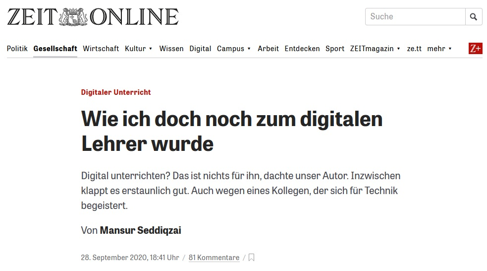
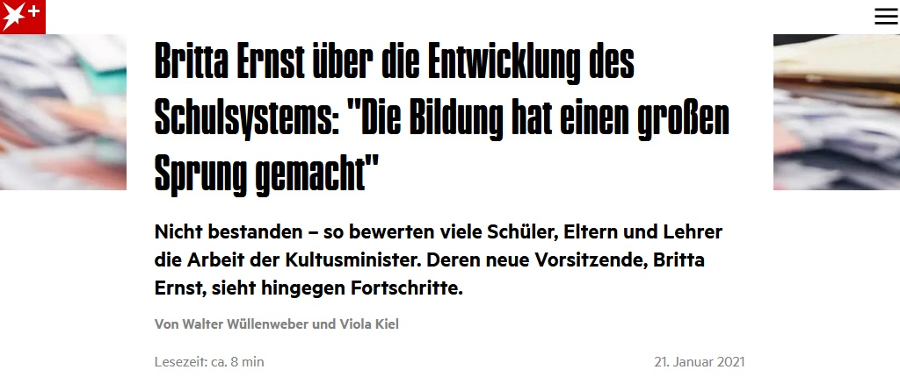
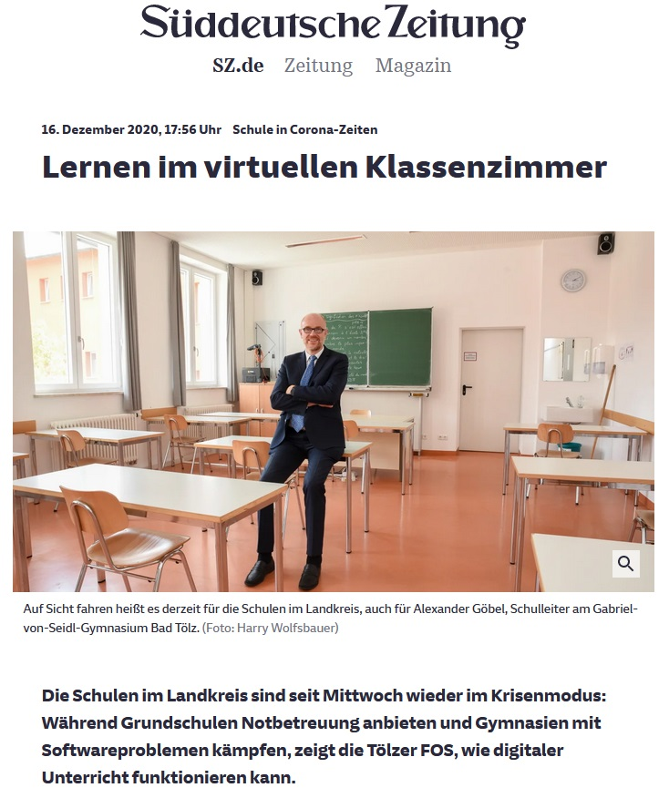
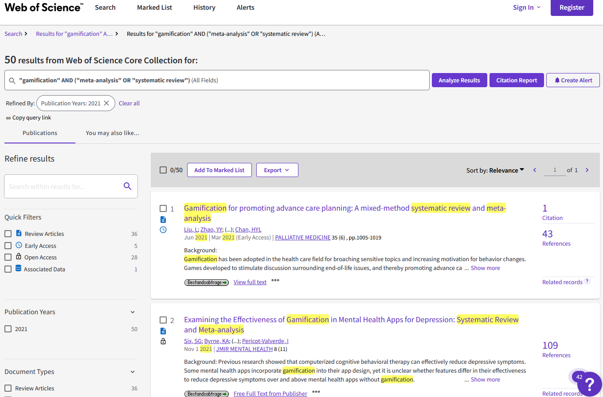

<style>
slides > slide:not(.nobackground):after {
  content: '';
}
</style>


```{r setup, include=FALSE}
knitr::opts_chunk$set(echo = FALSE,
                      message=FALSE, 
                      warning=FALSE)
# download.file("https://drive.google.com/uc?export=download&id=1NOgadyAeqmtqJ2mLI0GZHmOkavS5LLeW",
#               "dissemination/www/references.bib", overwrite = T)
library(fontawesome)
```


## Vorab

<br /> 
`r fa(name = "download", fill="grey")` Folien downloaden: [**bit.ly/diago-bc1**](https://bit.ly/diago-bc1)<br />
&nbsp;&nbsp;`r fa(name = "long-arrow-alt-right", fill="grey")` Rechtsklick auf Download > "Ziel/Link speichern unter"


<br /><br /><br /> 
`r fa(name = "eye", fill="grey")` Folien anschauen: [**bit.ly/diago-bc2**](https://bit.ly/diago-bc2)<br />
&nbsp;&nbsp;`r fa(name = "long-arrow-alt-right", fill="grey")` Pfeiltasten zum Blättern


## Digitalisierung im Fokus | Öffentlichkeit & Praxis

<div style="position:absolute; top: 25%; left: 5%; width: 40%; border: 1px solid grey;">{width=100%}</div>
<div style="position:absolute; top: 63%; left: 5%; width: 40%; border: 1px solid grey;">{width=100%}</div>
<div style="position:absolute; top: 15%; left: 55%; width: 40%; border: 1px solid grey;">{width=100%}</div>

<div style="position:absolute; top: 92%; left: 58%;">
<span class="mysource">
([Seddiqzai, 2020](https://www.zeit.de/gesellschaft/schule/2020-09/digitaler-unterricht-corona-schule-lehrer-ausstattung-tablets-laptops); [Wüllenweber & Kiel, 2021](https://www.stern.de/p/plus/gesellschaft/britta-ernst---die-bildung-hat-einen-grossen-sprung-gemacht--30005704.html); [Haselsteiner, 2020](https://www.sueddeutsche.de/muenchen/wolfratshausen/schule-in-corona-zeiten-lernen-im-virtuellen-klassenzimmer-1.5149552))
</span>
</div>


## Digitalisierung im Fokus | Politik & Lehrpersonenbildung

<br />
`r fa(name = "book-open", fill="grey")` Strategiepapiere "Medienbildung in der Schule" & "Bildung in der digitalen Welt" der KMK  
<span class="mysource">[@kmk.2012; @kmk.2016]</span>

<br />  
`r fa(name = "university", fill="grey")` QLB Förderschwerpunkt "Digitalisierung in der Lehrerbildung"  
<span class="mysource">[@bmbf.2018]</span>

<br />  
`r fa(name = "school", fill="grey")` "DigitalPakt Schule" des BMBF  
<span class="mysource">[@bmbf.2019]</span>

<br />  
`r fa(name = "clipboard-list", fill="grey")` Standards für die Lehrerbildung: Bildungswissenschaften<br /><br /><br />
<span class="mysource">[@kmk.2019]</span>


## Digitalisierung im Fokus | Politik & Lehrpersonenbildung

<br />
`r fa(name = "book-open", fill="grey")` Strategiepapiere "Medienbildung in der Schule" & "Bildung in der digitalen Welt" der KMK  
<span class="mysource">[@kmk.2012; @kmk.2016]</span>

<br />  
`r fa(name = "university", fill="grey")` QLB Förderschwerpunkt "Digitalisierung in der Lehrerbildung"  
<span class="mysource">[@bmbf.2018]</span>

<br />  
`r fa(name = "school", fill="grey")` "DigitalPakt Schule" des BMBF  
<span class="mysource">[@bmbf.2019]</span>

<br />  
`r fa(name = "clipboard-list", fill="grey")` Standards für die Lehrerbildung: Bildungswissenschaften<br />&nbsp;&nbsp;&nbsp;`r fa(name = "long-arrow-alt-right", fill="grey")` _digitale Medien didaktisch sinnvoll integrieren_<br />&nbsp;&nbsp;&nbsp;`r fa(name = "long-arrow-alt-right", fill="grey")` _Medienkompetenz ihrer Schülerinnen und Schüler aufbauen und weiter entwickeln_  
<span class="mysource">[@kmk.2019]</span>


##  <span class="header-margin">Quellen</span> | <span class="header-margin">des Wissens & Könnens</span>

<div class="box60r">
<br />

* praktische Erfahrung & wissenschaftliche Evidenz <span class="mysource">[@schneideretal.2020]</span><br /><br /><br />
* bisher nur wenig systematisch im Lehrpersonenbildungssystem verankert  <span class="mysource">(Monitor Lehrerbildung, 2021)</span><br /><br /><br /><br />`r fa(name = "arrow-right")` informelle Lernsettings als integrale Ressource<br /><br />
</div>

<div class="box-bg-l3">`r fa(name = "wifi", fill="white", width = "300px")`</div>


##  <span class="header-margin">Quellen</span> | <span class="header-margin">des Wissens & Könnens</span>

<div class="box60r">

\

__Informelle Lernsettings__

`r fa(name = "arrow-right")` was ist die beste verfügbare Evidenz?

\
\

__Forschungssynthesen__

* als „gesammeltes Wissen“ bzgl. eines Themas
* höchstes Level an Evidenz empirischer Forschung <span class="mysource">[@burnsetal.2011]</span>

</div>

<div class="box-bg-l3">`r fa(name = "wifi", fill="white", width = "300px")`</div>


##  &nbsp;

<div style="position: absolute; top:0; left:0; width:100%; height:100%">
{width=100%}
</div>


##  <span class="header-margin">Herausforderungen</span> | <span class="header-margin"> bei Forschungssynthesen</span>

<div class="box60r">
<br /><br />

* Anzahl an Forschungssynthesen<br /><br /><br />
* Verständnis & Evaluation voraussetzungsreich<br /><br /><br />

`r fa(name = "arrow-right")` Aufbereitung von Forschungssynthesen

</div>

<div class="box-bg-l3">`r fa(name = "question", fill="white", width = "230px")`</div>


## <span class="header-margin">Informationsangebot</span> | <span class="header-margin">TüDi-BASE</span>

<div class="box-bg-l2">{width=95%}</div>

<div class="box60r">
<br /><br />

* forschungsbasiert: Aufbereitung von __Forschungs-synthesen__<span class="mysource">[@apa.2006; @burnsetal.2011]</span><br /><br />
  - Voraussetzungen: Aktualität, Umsetzbarkeit, Innovationspotential, Qualität<br /><br /><br />
* spezifisch: Themenkomplex "__Digitalisierung__ in der Lehrpersonenbildung"<br /><br /><br />
* Zielgruppen: (angehende) __Lehrpersonen__ und __Lehrpersonenbildner:innen__

</div>


## <span class="header-margin">Informationsangebot</span> | <span class="header-margin">TüDi-BASE</span>

<div class="box-bg-l2">{width=95%}</div>

<div class="box60r">

<br />

__beantwortet Fragen zu:__

* Effektivität digitaler Medien
  - _Was_ ist effektiv (z. B. beim Einsatz digitaler Medien)?
  - Unter welchen _Bedingungen_ ist es effektiv?<br /><br />
* _Gesellschaftliche Aspekte_ der Mediennutzung (z. B. Ethik)

<br /><br /><br />
`r fa(name = "globe", fill="darkgrey", width = "20px")` __[tuedilb-tuebingen.de/tuedi-base.html](https://www.tuedilb-tuebingen.de/tuedi-base.html)__

</div>


##  <span class="header-margin">Zukunft</span> | <span class="header-margin">Wie geht es weiter?</span>

<div class="box60r">
<br />

* laufende Aufbereitung neuer Themen<br /><br /><br />
* Vernetzung mit anderen Clearing House Vorhaben (z. B. [Clearing House Unterricht](https://www.clearinghouse.edu.tum.de/))<br /><br /><br />
* evtl. Aufnahme von Themenwünschen, ähnlich ["Wissenskarussell"](https://www.kennisrotonde.nl/) aus den Niederlanden
</div>

<div class="box-bg-l3">`r fa(name = "forward", fill="white", width = "230px")`</div>


# Vielen Dank

{width=20%}  
\

__Jürgen Schneider__  
juergen.schneider@uni-tuebingen.de  


# {-}


<div id="refs"></div>


# &nbsp;
__Icons:__  

<span style="font-size:.7em;">
Icons by Font Awesome CC BY 4.0
</span>