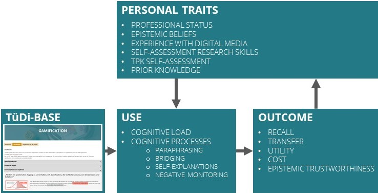
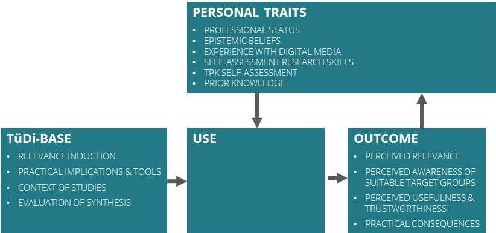
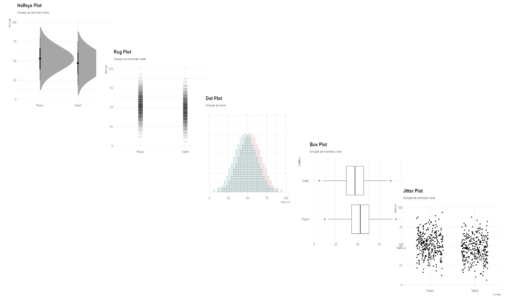

<style>
slides > slide:not(.nobackground):after {
  content: '';
}
</style>


```{r setup, include=FALSE}
knitr::opts_chunk$set(echo = FALSE,
                      message=FALSE, 
                      warning=FALSE)
# download.file("https://drive.google.com/uc?export=download&id=1wuMqL_Z8T9rxuGvn0VP6siag90kHDm2O",
#               "dissemination/www/references.bib", overwrite = T)
library(fontawesome)
# library(rmarkdown)
```


## Vorab

<br /> 
`r fa(name = "eye", fill="grey")` Folien anschauen: [**bit.ly/BASE-KA**](http://bit.ly/BASE-KA)<br />
&nbsp;&nbsp;`r fa(name = "long-arrow-alt-right", fill="grey")` Pfeiltasten zum Blättern


<br /><br /><br /> 
`r fa(name = "download", fill="grey")` Folien downloaden: [**bit.ly/BASE-KA-save**](http://bit.ly/BASE-KA-save)<br />
&nbsp;&nbsp;`r fa(name = "long-arrow-alt-right", fill="grey")` Rechtsklick auf Download > "Ziel/Link speichern unter"


## Digitale Medien

<div class="box60l">
<br /><br />

* Rasanter Wandel & wachsendes Forschungsaufkommen
* (Angehende) Lehrpersonen & Lehrerbildner*innen: didaktisch elaboriert, kritisch reflektiert und forschungsbasierter Einsatz
* bisher nur wenig systematisch im Lehrpersonenbildungssystem verankert -> informelle Lernsettings als integrale Ressource
* Bislang: fragmentierte und isolierte deutschsprachige Angebote

</div>

<div class="box-bg-r">`r fa(name = "question", fill="white", height = "500px")`</div>


## {-}

<div class="box-bg-l">TüDi-BASE</div>

<div class="box60r">

-> forschungsbasiertes und spezifisches Informationsangebot TüDi-BASE


__Zielgruppe__: (angehende) Lehrpersonen und Lehrpersonenbildner*innen

</div>


## {-}

<div class="box-bg-l">Selektion</div>

<div class="box60r">

Themencluster „Lernen mit digitalen Medien“ & „Medienbildung“ 
<br /><br />
__Themenauswahl__

* normativ ("top-down") auf Basis konzeptueller Rahmenmodelle
   + z. B. am Framework für digitale Kompetenzen von Lehrenden „DigCompEdu“ (Europäische Kommission, 2017; Caena & Redecker, 2019)
* "bottom-up": breitangelegte, regelmäßige, systematische Analyse der einschlägigen Datenbanken und Zeitschriften (Web of Science, ERIC)

</div>

## {-}

<div class="box-bg-l">Selektion</div>

<div class="box60r">

1. Relevanzdimensionen 
    * Aktueller Diskurs in Öffentlichkeit (und Forschung) 
    * Umsetzbarkeit in Schule/Unterricht 
    * Innovationspotential<br /> <br /><br />
2. Qualität der Forschungssynthese (Study DIAD) 
    * Präzision in Interventionen und Operationalisierung
    * Klarheit in der Schlussfolgerung
    * Generalisierbarkeit der Ergebnisse
    * Präzision der Schlussfolgerung


<span class="mysource">[@valentineetal.2008]</span>
</div>


## {-}
<div class="box-bg-l">Design</div>

<div class="box60r">
### **Gestaltungsprinzipien**
<br />

* Einfachheit und Klarheit in der Sprache <span class="mysource">[@kerweretal.2021] (McNamara, 2013)</span>
* Verwendung von "Hedges" <span class="mysource">[@braunetal.2014a]</span>

</div>


## {-}
<div class="box-bg-l">Design<br /><span style="font-size:0.4em; color:#ececec">Begleitforschung</span></div>

<div class="box60r">
### **Gestaltungsprinzipien**
<br />

* Einfachheit und Klarheit in der Sprache <span class="mysource">[@kerweretal.2021] (McNamara, 2013)</span>
* Verwendung von "Hedges" <span class="mysource">[@braunetal.2014a]</span>

<br /><br /><br /><br /><br />
<div class="container" style="margin-top:18px">
 <div style="width:50%; text-align:center">`r fa(name = "fas fa-comment-dots", height = "70px")`<br />Laut-Denken<br />Studie</div>
 <div style="width:50%; text-align:center">`r fa(name = "fas fa-eye", height = "70px")`<br />Eyetracking<br />Studie</div>
</div>

</div>


## {-}
<div class="box-bg-l">Design<br /><span style="font-size:0.4em; color:#ececec">Begleitforschung</span></div>

<div class="box60r">
{width=100%}

<br /><br /><br />
<div class="container">
 <div style="width:50%; text-align:center">`r fa(name = "fas fa-comment-dots", height = "70px")`<br />Laut-Denken<br />Studie</div>
 <div style="width:50%; text-align:center">`r fa(name = "fas fa-eye", height = "70px")`<br />Eyetracking<br />Studie</div>
</div>

</div>


## {-}

<div class="box-bg-l">Design</div>

<div class="box60r">
<br />

### **Inhaltliche Komponenten** 

1. Einführung, Definition, Relevanzinduktion <span class="mysource">[@mccruddenetal.2011]</span>
2. Erkenntnisse der Forschungsynthese & deren Kontext
3. Evaluation der Forschungssynthese<span class="mysource">[@hendriksetal.2020]</span>
4. Implikationen für die Praxis & Tools

<br /><br />


</div>

## {-}

<div class="box-bg-l">Design<br /><span style="font-size:0.4em; color:#ececec">Begleitforschung</span></div>

<div class="box60r">
<br />

### **Inhaltliche Komponenten** 

1. Einführung, Definition, <span style="background-color:#d3e4e6;">Relevanzinduktion</span> <span class="mysource">[@mccruddenetal.2011]</span>
2. Erkenntnisse der Forschungsynthese & deren <span style="background-color:#d3e4e6;">Kontext</span>
3. <span style="background-color:#d3e4e6;">Evaluation</span> der Forschungssynthese<span class="mysource">[@hendriksetal.2020]</span>
4. <span style="background-color:#d3e4e6;">Implikationen für die Praxis & Tools</span>

<br /><br />
<div style="text-align:center">`r fa(name = "fas fa-cubes", height = "70px")`<br />RCTs:<br />systematische Variation <br />von Komponenten</div>

</div>


## {-}

<div class="box-bg-l">Design<br /><span style="font-size:0.4em; color:#ececec">Begleitforschung</span></div>

<div class="box60r">

{width=100%}

<br /><br /><br />
<div style="text-align:center">`r fa(name = "fas fa-cubes", height = "70px")`<br />RCTs:<br />systematische Variation <br />von Komponenten</div>

</div>


## {-}

<div class="box-bg-l">Design</div>

<div class="box60r">
### **Effektstärken**
<br />

* alternative Effektstärkemaße <span class="mysource">[@haneletal.2019; @haneletal.2019a]</span>
* grafische Darbietung 


</div>


## {-}

<div class="box-bg-l">Design<br /><span style="font-size:0.4em; color:#ececec">Begleitforschung</span></div>

<div class="box60r">
### **Effektstärken**
<br />

* alternative Effektstärkemaße <span class="mysource">[@haneletal.2019; @haneletal.2019a]</span>
* grafische Darbietung (Correll, Bertini & Franconeri, 2020; Hanel, Maio & Manstead, 2019; Witt, 2019)

<br /><br />
<div style="text-align:center">`r fa(name = "fas fa-chart-area", height = "70px")`<br />Delphi & RCTs:<br />Effektstärken verständlich<br />visualisieren</div>

</div>


## {-}

<div class="box-bg-l">Design<br /><span style="font-size:0.4em; color:#ececec">Begleitforschung</span></div>

<div class="box60r">

**Studie 1:** (Delphi-Studie)  
  
Sammlung und Ranking von Visualisierungstypen  
\
\

{width=100%}  

</div>


## {-}

<div class="box-bg-l">Design<br /><span style="font-size:0.4em; color:#ececec">Begleitforschung</span></div>

<div class="box60r">
**Studie 1:**  
<div class="container">
 <div style="width:50%; font-size:0.85em">Sammlung und<br />{width=100%}</div>
 <div style="width:50%; font-size:0.8em">Ranking<br />{width=100%}</div>
</div>
von Visualisierungstypen (Delphi-Studie)  

  
**Studie 2:**  
Vergleich von Visualisierungstypen (RCT)  
  
**Studie 3:**  
Vergleich von Anreicherungsoptionen (RCT)

<br />Kooperation mit Kirstin Schmid & Samuel Merk

</div>


## Generierungprozess | Prototyping

**Feedback-Loops**

1. Prototyp
    - Feedback durch: Wissenschaftler\*innen
    - Fokus: wissenschaftliche Qualität <br /><br />
2. Prototyp:
    - Feedback durch: Lehrerbildner\*innen
    - Fokus: Passung zu Bedarf der Nutzergruppe <br /><br />
3. Prototyp: 
    - Feedback durch: Lehrpersonen
    - Fokus: Passung zu Bedarf der Nutzergruppe

<span class="mysource">[@seideletal.2017]</span>


# {-}


<div id="refs"></div>


# &nbsp;
__Images:__  
(in order of appearance)  
  
<span style="font-size:.7em;">

</span>