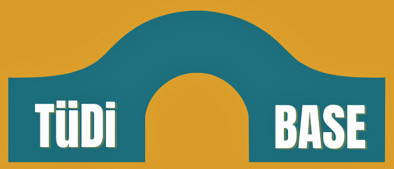
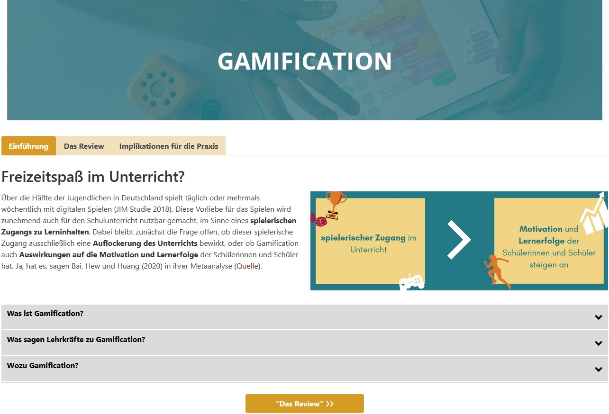

<style>
slides > slide:not(.nobackground):after {
  content: '';
}
</style>


```{r setup, include=FALSE}
knitr::opts_chunk$set(echo = FALSE,
                      message=FALSE, 
                      warning=FALSE)
# download.file("https://drive.google.com/uc?export=download&id=1NOgadyAeqmtqJ2mLI0GZHmOkavS5LLeW",
#               "dissemination/www/references.bib", overwrite = T)
library(fontawesome)
# library(rmarkdown)
```


##  <span class="header-margin">Digitale Medien</span>

<div class="box60r">
<br />

* Rasanter Wandel & wachsendes Forschungsaufkommen <span class="mysource">[@scheiter.2021]</span><br /><br />
* Anforderung an (angehende) Lehrpersonen & Lehrerbildner:innen <span class="mysource">[@kmk.2016; @bmbf.2018; @bmbf.2019; @kmk.2019]</span><br /><br />
* bisher nur wenig systematisch im Lehrpersonenbildungssystem verankert  <span class="mysource">(Monitor Lehrerbildung, 2021)</span><br /><br /><br />`r fa(name = "arrow-right")` informelle Lernsettings als integrale Ressource<br /><br />
* Bislang: fragmentierte und isolierte deutschsprachige Angebote

</div>

<div class="box-bg-l2">`r fa(name = "wifi", fill="white", width = "300px")`</div>


## <span class="header-margin">Informationsangebot</span> | <span class="header-margin">TüDi-BASE</span>

<div class="box-bg-l2">{width=95%}</div>

<div class="box60r">
<br /><br />

* forschungsbasiert: Aufbereitung von __Forschungs-synthesen__<span class="mysource">[@apa.2006; @burnsetal.2011]</span><br /><br /><br />
* spezifisch: Themenkomplex "__Digitalisierung__ in der Lehrpersonenbildung"<br /><br /><br />
* Zielgruppen: (angehende) __Lehrpersonen__ und __Lehrpersonenbildner:innen__

</div>


# Aufbau & Begleitforschung


## Selektion | Themen

<div class="box-bg-r">`r fa(name = "clipboard-check", fill="white", width = "200px")`</div>

<div class="box60l">

__Themencluster__  
„Lernen mit digitalen Medien“ & „Medienbildung“ <span class="mysource">[@kmk.2016; @bmbf.2018; @bmbf.2019; @kmk.2019]</span>
<br /><br /><br />
__Themenauswahl__

* normativ ("top-down") auf Basis konzeptueller Rahmenmodelle (z.B. DigCompEdu) <span class="mysource">[@europeancommission.2017a; @caenaetal.2019]</span><br /><br /><br />
* "bottom-up": systematische Analyse einschlägiger Datenbanken (Web of Science, ERIC)

</div>

## Selektion | Forschungssynthesen

<div class="box-bg-r">`r fa(name = "clipboard-check", fill="white", width = "200px")`</div>

<div class="box60l">
__Eigene Erstellung__ von Forschungssynthesen, z.B. 
<br />

* Learning by teaching on video<span class="mysource">(Lachner, Hoogerheide, van Gog & Renkl, 2021)</span><br /><br />
* Combining real and virtual experiments in science education <span class="mysource">(Wörner, Kuhn & Scheiter, accepted)</span><br /><br />
* Computer-based feedback on writing <span class="mysource">(Wagner, Schneider & Lachner, in prep.)</span>

\
\

__Standards:__

Template zur Präregistrierung<span class="mysource">[@schneideretal.2022]</span>

</div>


## Selektion | Forschungssynthesen

<div class="box-bg-r">`r fa(name = "clipboard-check", fill="white", width = "200px")`</div>

<div class="box60l">
__Bestehende Forschungssynthesen__
<br /><br />

1. Relevanzdimensionen 
    * Aktueller Diskurs in Öffentlichkeit (und Forschung) 
    * Umsetzbarkeit in Schule/Unterricht 
    * Innovationspotential<br /> <br /><br />
2. Qualität der Forschungssynthese (Study DIAD) 
    * Präzision in Interventionen und Operationalisierung
    * Klarheit in der Schlussfolgerung
    * Generalisierbarkeit der Ergebnisse
    * Präzision der Schlussfolgerung


<span class="mysource">[@valentineetal.2008]</span>
</div>


## <span class="header-margin">Gestaltungsprinzipien</span>
<div class="box-bg-l">Design</div>

<div class="box60r">

* Einfachheit und Klarheit in der Sprache <span class="mysource">[@kerweretal.2021; @mcnamara.2013; @scharreretal.2021]</span><br /><br />
* Verwendung von "Hedges" <span class="mysource">[@braunetal.2014a]</span>



[www.tuedilb-tuebingen.de/gamification.html](https://www.tuedilb-tuebingen.de/gamification.html)
</div>


## <span class="header-margin">Gestaltungsprinzipien</span>
<div class="box-bg-l">Design<br /><span style="font-size:0.4em; color:#ececec">Begleitforschung</span></div>

<div class="box60r">

* Einfachheit und Klarheit in der Sprache <span class="mysource">[@kerweretal.2021; @mcnamara.2013; @scharreretal.2021]</span><br /><br />
* Verwendung von "Hedges" <span class="mysource">[@braunetal.2014a]</span>

<br /><br /><br /><br /><br /><br />
<div class="container" style="margin-top:34px">
 <div style="width:50%; text-align:center">`r fa(name = "fas fa-comment-dots", height = "70px")`<br />Laut-Denken<br />Studie</div>
 <div style="width:50%; text-align:center">`r fa(name = "fas fa-eye", height = "70px")`<br />Eyetracking<br />Studie</div>
</div>

</div>


## {-}
<div class="box-bg-l">Design<br /><span style="font-size:0.4em; color:#ececec">Begleitforschung</span></div>

<div class="box60r">
{width=100%}

<br /><br /><br /><br />
<div class="container">
 <div style="width:50%; text-align:center">`r fa(name = "fas fa-comment-dots", height = "70px")`<br />Laut-Denken<br />Studie</div>
 <div style="width:50%; text-align:center">`r fa(name = "fas fa-eye", height = "70px")`<br />Eyetracking<br />Studie</div>
</div>
<br /><br />
Präregistrierung: [doi.org/10.17605/OSF.IO/5UCTY](https://doi.org/10.17605/OSF.IO/5UCTY)
</div>


## <span class="header-margin">Inhaltliche Komponenten</span>

<div class="box-bg-l">Design</div>

<div class="box60r">

1. Einführung, Definition, Relevanzinduktion <span class="mysource">[@mccruddenetal.2011]</span>
2. Erkenntnisse der Forschungsynthese & deren Kontext
3. Evaluation der Forschungssynthese<span class="mysource">[@hendriksetal.2020]</span>
4. Implikationen für die Praxis & Tools


</div>

## <span class="header-margin">Inhaltliche Komponenten</span>

<div class="box-bg-l">Design<br /><span style="font-size:0.4em; color:#ececec">Begleitforschung</span></div>

<div class="box60r">

1. Einführung, Definition, <span style="background-color:#d3e4e6;">Relevanzinduktion</span> <span class="mysource">[@mccruddenetal.2011]</span>
2. Erkenntnisse der Forschungsynthese & deren <span style="background-color:#d3e4e6;">Kontext</span>
3. <span style="background-color:#d3e4e6;">Evaluation</span> der Forschungssynthese<span class="mysource">[@hendriksetal.2020]</span>
4. <span style="background-color:#d3e4e6;">Implikationen für die Praxis & Tools</span>

<br /><br /><br />
<div style="text-align:center; margin-top: 7px;">`r fa(name = "fas fa-cubes", height = "70px")`<br />RCTs:<br />systematische Variation <br />von Komponenten</div>

</div>


## {-}

<div class="box-bg-l">Design<br /><span style="font-size:0.4em; color:#ececec">Begleitforschung</span></div>

<div class="box60r">

{width=100%}

<br /><br /><br />
<div style="text-align:center">`r fa(name = "fas fa-cubes", height = "70px")`<br />RCTs:<br />systematische Variation <br />von Komponenten</div>

</div>


## <span class="header-margin">Effektstärken</span>

<div class="box-bg-l">Design</div>

<div class="box60r">

* Interpretation und Verständnis einer Effektgröße als große Herausforderung
  - alternative Effektstärkemaße <span class="mysource">[@haneletal.2019a;<br /> @lortie-forguesetal.2021]</span><br /><br />
  - Standardisierte Maße nicht greifbar <span class="mysource">[@lipseyetal.2012]</span><br /><br />
  - nicht-standardisierte Maße problematisch <span class="mysource">[@bairdetal.2019; @kraft.2020]</span><br /><br />
* grafische Darbietung 

{width=100%}

</div>


## <span class="header-margin">Effektstärken</span>

<div class="box-bg-l">Design<br /><span style="font-size:0.4em; color:#ececec">Begleitforschung</span></div>

<div class="box60r">

* Interpretation und Verständnis einer Effektgröße als große Herausforderung
  - alternative Effektstärkemaße <span class="mysource">[@haneletal.2019a;<br /> @lortie-forguesetal.2021]</span><br /><br />
  - Standardisierte Maße nicht greifbar <span class="mysource">[@lipseyetal.2012]</span><br /><br />
  - nicht-standardisierte Maße problematisch <span class="mysource">[@bairdetal.2019; @kraft.2020]</span><br /><br />
* grafische Darbietung 

<br />
<div style="text-align:center">`r fa(name = "fas fa-chart-area", height = "70px")`<br />Delphi & RCTs:<br />Effektstärken verständlich<br />visualisieren</div>

</div>


## <span class="header-margin">Effektstärken</span>

<div class="box-bg-l">Design<br /><span style="font-size:0.4em; color:#ececec">Begleitforschung</span></div>

<div class="box60r">
**Studie 1:** (Delphi-Studie)  
  
* **4 Experten** in Data Visualization
* Phase 1: Sammlung von **16 Visualisierungstypen** <br />(für Gruppenscores auf metrischer Variable)

\

{width=100%}  

</div>

## <span class="header-margin">Effektstärken</span>

<div class="box-bg-l">Design<br /><span style="font-size:0.4em; color:#ececec">Begleitforschung</span></div>

<div class="box60r">
**Studie 1:** (Delphi-Studie)  
  
* **4 Experten** in Data Visualization
* Phase 1: Sammlung von **16 Visualisierungstypen** <br />(für Gruppenscores auf metrischer Variable)
* Phase 2: Rating und Ranking von **44 Visualisierungen**<br />(meist 3 Arten der Gruppenunterscheidung)

\
\

{width=100%}  

</div>


## <span class="header-margin">Effektstärken</span>

<div class="box-bg-l">Design<br /><span style="font-size:0.4em; color:#ececec">Begleitforschung</span></div>

<div class="box60r">
**Studie 1:** (Delphi-Studie)  
  
* **4 Experten** in Data Visualization
* Phase 1: Sammlung von **16 Visualisierungstypen** <br />(für Gruppenscores auf metrischer Variable)
* Phase 2: Rating und Ranking von **44 Visualisierungen**<br />(meist 3 Arten der Gruppenunterscheidung)

_"How accurately might teachers assess the effect size depicted in the plot above?"_  
(7-stufige Likert Skala; totally random - totally accurate)


</div>


## <span class="header-margin">Effektstärken</span>

<div class="box-bg-l">Design<br /><span style="font-size:0.4em; color:#ececec">Begleitforschung</span></div>

<div class="box60r">
**Studie 1:** (Delphi-Studie)  
  
* **4 Experten** in Data Visualization
* Phase 1: Sammlung von **16 Visualisierungstypen** <br />(für Gruppenscores auf metrischer Variable)
* Phase 2: Rating und Ranking von **44 Visualisierungen**<br />(meist 3 Arten der Gruppenunterscheidung)

_"How accurately might teachers assess the effect size depicted in the plot above?"_  
(7-stufige Likert Skala; totally random - totally accurate)

__Ergebnisse: Top 4__

{width=100%}  

</div>


## <span class="header-margin">Effektstärken</span>

<div class="box-bg-l">Design<br /><span style="font-size:0.4em; color:#ececec">Begleitforschung</span></div>

<div class="box60r">
**Studie 2:** (RCT)

* **UV**: Vergleich der Top 4 **Visualisierungstypen**<br />(Vignettenbasiert, z.B. digitales vs. analoges Lesen)  
* **AVs**: 
  - *Sensitivität*
  - *Akkuratheit*
  - *Effizienz*
  - Einschätzung handlungsnaher Konsequenzen
  - Relevanzeinschätzung
  - Wahrscheinlichkeit die Intervention in der Praxis umzusetzen
  - Cognitive Load
* **KVs**:
  - Confirmation Bias
  - Rotation der Größe des Effekts
  - Rotation der Vignetten
  
</div>


## <span class="header-margin">Effektstärken</span>

<div class="box-bg-l">Design<br /><span style="font-size:0.4em; color:#ececec">Begleitforschung</span></div>

<div class="box60r">
**Studie 3:** (RCT)

* **UV**: Vergleich von **Anreicherungsoptionen**<br />(z.B. Benchmarks ja/nein; Grafik/Text/Integriert)  
* **AVs**: 
  - *Sensitivität*
  - *Akkuratheit*
  - *Effizienz*
  - Einschätzung handlungsnaher Konsequenzen
  - Relevanzeinschätzung
  - Wahrscheinlichkeit die Intervention in der Praxis umzusetzen
  - Cognitive Load
* **KVs**:
  - Confirmation Bias
  - Rotation der Größe des Effekts
  - Rotation der Vignetten

</div>


# Diskussion

## Diskussion

* TüDi-BASE: spezifisches Angebot zur informellen Fortbildung<br /><br />
* aktuell 5 Forschungssynthesen aufbereitet, stetiger Ausbau<br /><br />
* Generierung und Aufbereitung eigener Forschnugssynthesen<br /><br />
* systematische Begleitforschung

\

<span style="background-color: #ececec; padding: 10px; color: white; vertical-align:middle;">`r fa(name = "globe", height = "20px", fill="#646a6b")` [www.tuedilb-tuebingen.de/tuedi-base.html](https://www.tuedilb-tuebingen.de/tuedi-base.html)


# Vielen Dank

{width=20%}  
\

__Jürgen Schneider__  
juergen.schneider@uni-tuebingen.de  


# {-}


<div id="refs"></div>


# &nbsp;
__Icons:__  

<span style="font-size:.7em;">
Icons by Font Awesome CC BY 4.0
</span>