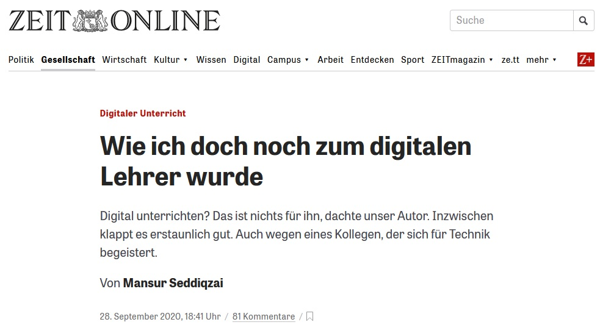
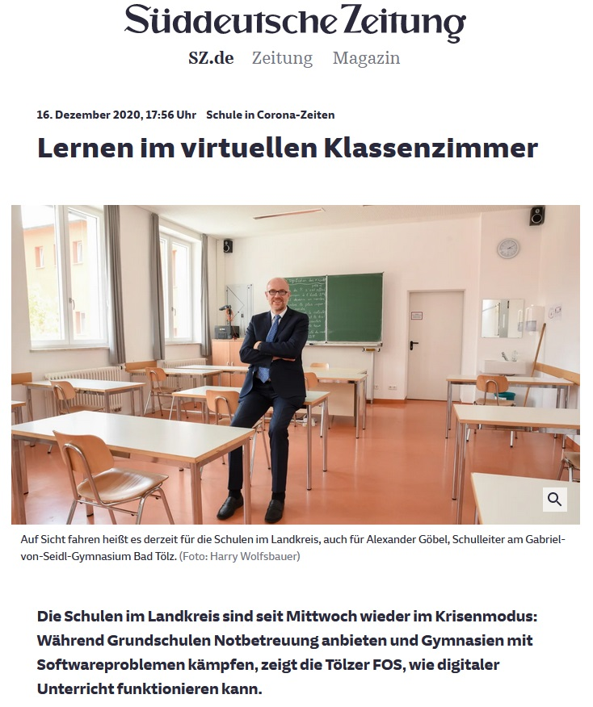

<style>
slides > slide:not(.nobackground):after {
  content: '';
}
</style>


```{r setup, include=FALSE}
knitr::opts_chunk$set(echo = FALSE,
                      message=FALSE, 
                      warning=FALSE)
# download.file("https://drive.google.com/uc?export=download&id=1wuMqL_Z8T9rxuGvn0VP6siag90kHDm2O",
#               "dissemination/www/references.bib", overwrite = T)
library(fontawesome)
# library(rmarkdown)
```

## Vorab

<br /> 
`r fa(name = "eye", fill="grey")` Folien anschauen: [**bit.ly/BASE-KA**](http://bit.ly/BASE-KA)<br />
&nbsp;&nbsp;`r fa(name = "long-arrow-alt-right", fill="grey")` Pfeiltasten zum Blättern


<br /><br /><br /> 
`r fa(name = "download", fill="grey")` Folien downloaden: [**bit.ly/BASE-KA-save**](http://bit.ly/BASE-KA-save)<br />
&nbsp;&nbsp;`r fa(name = "long-arrow-alt-right", fill="grey")` Rechtsklick auf Download > "Ziel/Link speichern unter"


## Digitalisierung im Fokus | Öffentlichkeit & Praxis

<div style="position:absolute; top: 25%; left: 5%; width: 40%; border: 1px solid grey;">{width=100%}</div>
<div style="position:absolute; top: 63%; left: 5%; width: 40%; border: 1px solid grey;">{width=100%}</div>
<div style="position:absolute; top: 15%; left: 55%; width: 40%; border: 1px solid grey;">{width=100%}</div>

<div style="position:absolute; top: 92%; left: 58%;">
<span class="mysource">
([Seddiqzai, 2020](https://www.zeit.de/gesellschaft/schule/2020-09/digitaler-unterricht-corona-schule-lehrer-ausstattung-tablets-laptops); [Wüllenweber & Kiel, 2021](https://www.stern.de/p/plus/gesellschaft/britta-ernst---die-bildung-hat-einen-grossen-sprung-gemacht--30005704.html); [Haselsteiner, 2020](https://www.sueddeutsche.de/muenchen/wolfratshausen/schule-in-corona-zeiten-lernen-im-virtuellen-klassenzimmer-1.5149552))
</span>
</div>


## Digitalisierung im Fokus | Politik & Lehrpersonenbildung

<br />
`r fa(name = "book-open", fill="grey")` Strategiepapiere "Medienbildung in der Schule" & "Bildung in der digitalen Welt" der KMK  
<span class="mysource">[@kmk.2012; @kmk.2016]</span>

<br />  
`r fa(name = "university", fill="grey")` QLB Förderschwerpunkt "Digitalisierung in der Lehrerbildung"  
<span class="mysource">[@bmbf.2018]</span>

<br />  
`r fa(name = "school", fill="grey")` "DigitalPakt Schule" des BMBF  
<span class="mysource">[@bmbf.2019]</span>

<br />  
`r fa(name = "clipboard-list", fill="grey")` Standards für die Lehrerbildung: Bildungswissenschaften<br /><br /><br />
<span class="mysource">[@kmk.2019]</span>


## Digitalisierung im Fokus | Politik & Lehrpersonenbildung

<br />
`r fa(name = "book-open", fill="grey")` Strategiepapiere "Medienbildung in der Schule" & "Bildung in der digitalen Welt" der KMK  
<span class="mysource">[@kmk.2012; @kmk.2016]</span>

<br />  
`r fa(name = "university", fill="grey")` QLB Förderschwerpunkt "Digitalisierung in der Lehrerbildung"  
<span class="mysource">[@bmbf.2018]</span>

<br />  
`r fa(name = "school", fill="grey")` "DigitalPakt Schule" des BMBF  
<span class="mysource">[@bmbf.2019]</span>

<br />  
`r fa(name = "clipboard-list", fill="grey")` Standards für die Lehrerbildung: Bildungswissenschaften<br />&nbsp;&nbsp;&nbsp;`r fa(name = "long-arrow-alt-right", fill="grey")` _digitale Medien didaktisch sinnvoll integrieren_<br />&nbsp;&nbsp;&nbsp;`r fa(name = "long-arrow-alt-right", fill="grey")` _Medienkompetenz ihrer Schülerinnen und Schüler aufbauen und weiter entwickeln_  
<span class="mysource">[@kmk.2019]</span>

## Lehrpersonenbildung | kompetenztheoretischer Professionsansatz

* Facetten professioneller Handlungskompetenz
<span class="mysource">[@baumertetal.2006]</span>

{width=68%}


<div class="notes">

* Valenz digitaler Medien
* Selbstwirksamkeit

V.a. die Valenz erhöhen wir ja (hoffentlich) mit TüDiBASE und die Selbstwirksamkeit vllt auch indirekt in dem wir konkrete Umsetzungsvorschläge bieten und eben das Wissen erhöhen?
</div>


## Lehrpersonenbildung | kompetenztheoretischer Professionsansatz

* Facetten professioneller Handlungskompetenz
<span class="mysource">[@baumertetal.2006]</span>

{width=78%}
<span class="mysource">[@mishraetal.2006]</span>

<div class="notes">

* Mediendidaktik
    * Informationsverarbeitung mit digitalen Medien
    * Formate multimedialen Lernens
* Medienpädagogik
    * Mediensozialisation 
* Fachdidaktik
    * fachspezifische Einsatzszenarien digitaler Medien

</div>


## Lehrpersonenbildung | Forschungssynthesen als Wissensbasis

* Forschungssynthesen als „gesammeltes Wissen“ bzgl. eines Themas
* höchstes Level an Evidenz empirischer Forschung <span class="mysource">[@burnsetal.2011]</span>

<br />
`r fa(name = "long-arrow-alt-right", fill="grey")` ideal für die Lehrpersonenbildung?
<br /><br /><br />

__Herausforderungen__ 

* „auf dem neuesten Stand“ bleiben nach dem Studium überhaupt leistbar?
* Verständnis und Beurteilung von Forschungssynthesen sehr voraussetzungsreich 


## Lehrpersonenbildung | Lösungsansatz durch Wissenschaftskommunikation

Aufbereitung einzelner Forschungssynthesen für 

* Lehrpersonenbildung (erste, zweite, dritte Phase) 
* Lehrpersonen (aktiv & in Ausbildung) 

# TüDi-BASE | Aufbereitete Forschungssynthesen zum Thema Digitalisierung


## Fragen

<div class="box60l">
<br /><br />

1. Welche **Themen** sollen aufbereitet werden?<br /><br /><br />
2. Wie werden Forschungssynthesen <br />innerhalb dieser Themen **selektiert**?<br /><br /><br />
3. Wie wird wissenschaftliches Wissen <br />**aufbereitet und dargestellt**?  

</div>

<div class="box-bg-r">`r fa(name = "question", fill="white", height = "50%")`</div>


## {-}

<div class="box-bg-l">Themen</div>

<div class="box60r">

<br /><br />

__Top-down Strategie__  
  
Themen des Moduls  
  
_„Lehren und Lernen mit digitalen Medien“_  
(M.Ed. Bildungswissenschaftliches Studium)  
<br /><br />
`r fa(name = "long-arrow-alt-right", fill="grey")` quantitative & qualitative Forschungssynthesen  

</div>


## {-}

<div class="struktur"></div>

## {-}

<div class="box-bg-l">Selektion</div>

<div class="box60r">
<br /><br />

1. Relevanzdimensionen 
    * Aktueller Diskurs in Öffentlichkeit (und Forschung) 
    * Umsetzbarkeit in Schule/Unterricht 
    * Innovationspotential<br /> <br /><br />
2. Qualität der Forschungssynthese (Study DIAD) 
    * Peer Review Journals 
    * Generalisierbarkeit der Ergebnisse 
    * Strenge der Inklusions- & Exklusionskriterien 

<span class="mysource">[@valentineetal.2008]</span>
</div>


## {-}

<div class="box-bg-l">Design</div>

<div style="position:absolute; bottom:0%; right:0%; width: 17%; height:5%; background-color: #bad1d5; font-size: .8em; padding:25px 5px 5px 5px;">erster Entwurf [hier](https://raw.githack.com/j-5chneider/TuDi-BASE/main/tudi-base.html#gamification-1)</div>

<div class="box60r">
<br />

**Inhaltliche Struktur** 

1. Einführung, Definition, Relevanzinduktion <span class="mysource">[@mccruddenetal.2011]</span>
2. Erkenntnisse der Forschungsynthese & Einordnung <span class="mysource">[@hendriksetal.2020]</span>
3. Für die Praxis (Implikationen, Tools)

<br /><br />
**Gestaltungsprinzipien**

* Einfachheit und Klarheit in der Sprache <span class="mysource">[@kerweretal.2021]</span>
* Verwendung von "Hedges" <span class="mysource">[@braunetal.2014a]</span>

<br /><br />
**Effektstärken**

* alternative Effektstärkemaße <span class="mysource">[@haneletal.2019; @haneletal.2019a]</span>
* grafische Darbietung 

</div>

## Generierungprozess | Prototyping

**Feedback-Loops**

1. Prototyp
    - Feedback durch: Wissenschaftler\*innen
    - Fokus: wissenschaftliche Qualität <br /><br />
2. Prototyp:
    - Feedback durch: Lehrerbildner\*innen
    - Fokus: Passung zu Bedarf der Nutzergruppe <br /><br />
3. Prototyp: 
    - Feedback durch: Lehrpersonen
    - Fokus: Passung zu Bedarf der Nutzergruppe

<span class="mysource">[@seideletal.2017]</span>


## Begleitforschung

1. Laut-Denken-Studie
    - Fokus / Schwerpunkte bei der Exploration der Inhalte
    - Irritationen / Missverständnisse bei den Inhalten
    - Usability <br /><br />
2. Experimentelle Studien 
    - Darstellungen von Effektstärken<br />`r fa(name = "long-arrow-alt-right", fill="grey")` Verständnis & Einordnung der Effekstärkemaße 
    - Effekte auf Valenz


# {-}


<div id="refs"></div>


# &nbsp;
__Images:__  
(in order of appearance)  
  
<span style="font-size:.7em;">
<a href="https://unsplash.com/@matt__feeney?utm_source=unsplash&amp;utm_medium=referral&amp;utm_content=creditCopyText">matthew Feeney</a> on <a href="https://unsplash.com/?utm_source=unsplash&amp;utm_medium=referral&amp;utm_content=creditCopyText">Unsplash</a>  
Reproduced by permission of the publisher, © 2012 by tpack.org
</span>