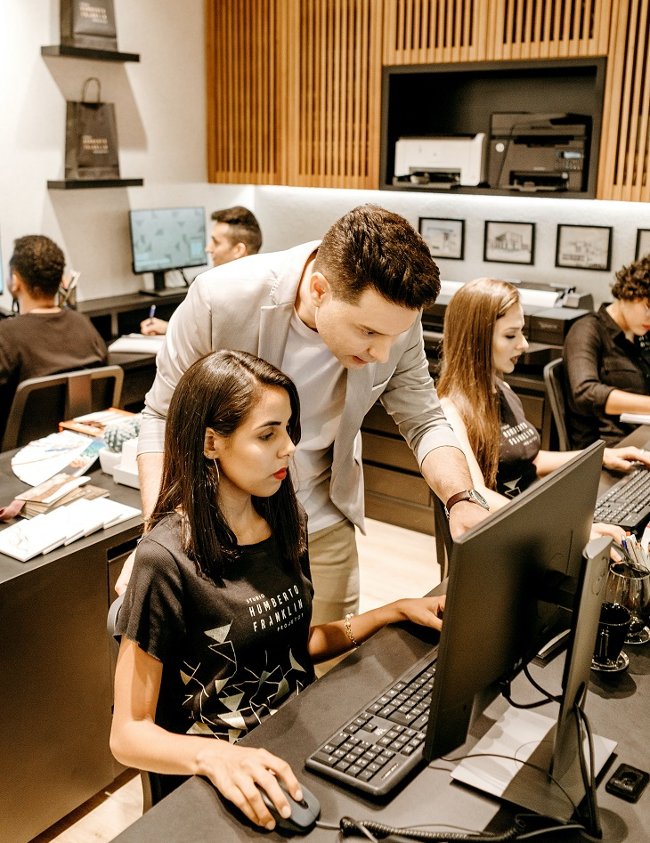
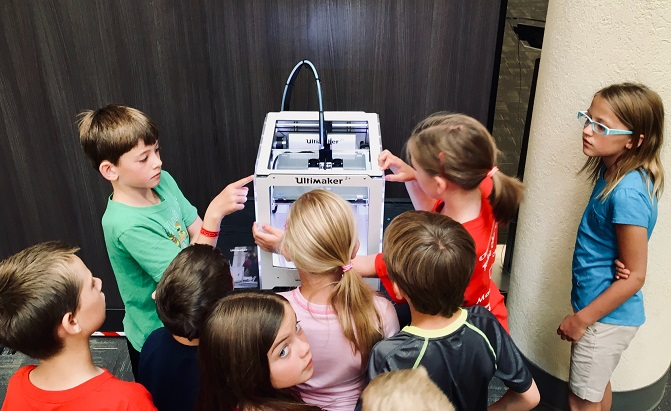
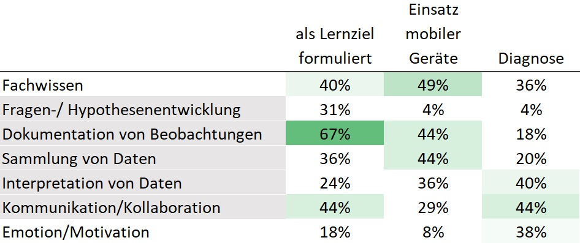

```{r setup, include=FALSE}
library(flexdashboard)
library(tidyverse)
library(shiny)
library(fontawesome)
```

# Übersicht  {data-icon="fa-sort-alpha-down"}

Row 
-----------------------------------------------------------------------

<div style="margin: 2% 15% 0 15%">
<span style="text-weight: bold; font-size: 2em">Was wissen wir über...?</span>   
\

Auf diesen Seiten erhalten Sie verständlich aufbereitete Informationen zu Erkenntnissen aus der Lehr-Lernforschung und Unterrichtsforschung rund um das Thema __digitale Medien in der Schule__.  

Die hier aufbereiteten Erkenntnisse spiegeln Forschungsergebnisse von so genannten systematischen Übersichtsarbeiten (d.h., Forschungssynthesen, Reviews, Metaanalysen) dar. Diese Übersichtsarbeiten sind von verschiedenen Autorinnen und Autoren als Fachartikel erstellt worden und in Fachzeitschriften meist in englischer Sprache erschienen. Für die Übersicht hier sind diese Fachartikel auf Deutsch und in adresssatengerechter Sprache aufbereitet. Zudem werden ausgehend von den wissenschaftlichen Erkenntnissen Implikationen für das Unterrichten und Lernen abgeleitet.

</div>







Row
-----------------------------------------------------------------------

### [Arbeiten in Gruppen](#unterstützung-beim-lernen-in-gruppen) {.transp .kachel1}
<div class="kacheltextbox">[„Computer Supported Collaborative Learning” verwendet digitale Medien, um das Lernen in Gruppen aller Größen zu unterstützen.](#unterstützung-beim-lernen-in-gruppen)</div>

### [Gamification](#gamification-1) {.transp .kachel2}
<div class="kacheltextbox">[Gamification ist die Nutzung von spielerischen Elementen während des Lernens. Gamification führt zu mehr Lernerfolg als ohne spielerische Elemente zu lernen](#gamification-1)</div>

### [Lehrer-Schüler-Beziehungen online](#lehrer-schüler-beziehung-im-online-klassenraum) {.transp .kachel3}
<div class="kacheltextbox">[Der Online-Klassenraum besitzt Merkmale, die sich zu einem herkömmlichen Klassenraum unterscheiden und die Beziehung zwischen Lehrenden und Lernenden prägen.](#lehrer-schüler-beziehung-im-online-klassenraum)</div>

### [Mobile Geräte im Freien](#mobile-geräte-beim-lernen-im-freien) {.transp .kachel4}
<div class="kacheltextbox">[Mobile Endgeräte, wie Smartphones oder Tablets, werden dazu genutzt Lerngelegenheiten auf außerhalb des Klassenzimmers zu erweitern.](#mobile-geräte-beim-lernen-im-freien)</div>


Row
-----------------------------------------------------------------------

### Medienbildung {.transp .kachel5}
<div class="kacheltextbox">Medienbildung beschreibt das Lernen mit aber auch vor allem über Medien, wie deren kritisch-reflexiver Umgang und bspw. Wissen zu datenschutzrechtlichen Fragen.</div>

### Effekte intensiver Nutzung digitaler Medien {.transp .kachel6}
<div class="kacheltextbox"> Die intensive Nutzung digitaler Medien hat Auswirkungen auf das Selbstvetrauen und Selbstwirksamkeit im Umgang mit digitalen Medien, aber auch auf die Angst vor digitalen Medien.</div>

### Digitale Gesundheit {.transp .kachel7}
<div class="kacheltextbox"> Digitale Gesundheit oder digitales Wohlergehen (engl. "digital well-being") bezieht sich auf die Auswirkungen digitaler Medien auf das Leben.</div>

### Nutzung komplexer Technologien {.transp .kachel8}
<div class="kacheltextbox"> Die Nutzung komplexer Technologien, wie Anwendungen von virtuellen oder erweiterten Realitäten ist sehr vielversprechend. Doch sind sie den Aufwand wert?</div>


# Unterstützung beim Lernen in Gruppen {data-navmenu="Kurzreviews" data-icon="fa-list-alt"}


Row {.tabset}
-----------------------------------------------------------------------

### Einführung {data-width=50}


<div class="container">
<div class="box30_1">
</div>


<div class="box60">
__Definition: Was ist „Technologieunterstützung beim Lernen in Gruppen“?__  

Das sogenannte „Computer Supported Collaborative Learning” verwendet digitale Medien, um das Lernen in Gruppen aller Größen zu unterstützen. Der Fokus liegt dabei darauf, _welche_ technologische Innovationen _wie_ eingesetzt werden können, um Gruppenlernprozesse, das Teilen von Wissen und die gemeinsame Wissenskonstruktion zu ermöglichen.
\
\

__Funktionen für das Unterrichten: Warum „Technologieunterstützung beim Lernen in Gruppen“?__  

Es stehen besonders lernförderliche Motivation und Emotionen der Gruppenteilnehmenden beim Lernen im Fokus der Forschung. Diese beeinflussen die Qualität der individuellen Lernprozesse der Schüler*innen. Letztendlich soll mit der Technologieunterstützung beim Lernen in Gruppen der Wissenserwerb und Problemlösekompetenzen gesteigert werden.  
  
Neben individuellen Aspekten können auch soziale Prozesse innerhalb der Gruppe angesprochen werden. Technologie soll dabei unterstützen die Rollen in Gruppenarbeiten zu klären oder Aktivitäten/ Beteiligungen sichtbar zu machen. Zudem können computerbasierte Tools dabei unterstützen Peer-Feedback, Diskussionen oder gemeinsame Problemlösestrategien zu strukturieren.  
  
Gruppenarbeit ist eine häufig eingesetzte Sozialform im Unterricht. Bisher existierte allerdings noch keine Übersicht, _welche Arten computerbasierter Tools_ zu welchen Effekten beim Lernen in Gruppen führen. Außerdem besteht noch keine systematische Analyse, _welche Strategien der Gruppenarbeit_ durch Technologieunterstützung computerbasiert gefördert werden können.  
  
Mit ihrer Metaanalyse diese gehen [Chen, Kirschner und Tsai (2018)](http://doi.org/10.3102/0034654318791584) diese Fragen an.
\

</div>
</div>

<div class="box30" style="font-size: 0.7em; font-style: italic; margin-left:5%">
Photo by <a href="https://unsplash.com/@johnschno?utm_source=unsplash&amp;utm_medium=referral&amp;utm_content=creditCopyText">John Schnobrich</a> on <a href="https://unsplash.com/s/photos/student-group?utm_source=unsplash&amp;utm_medium=referral&amp;utm_content=creditCopyText">Unsplash</a>
</div>

### Das Review {data-width=50}

<div class="container">

<div class="box30" style="margin-top:25%">
```{r, fig.width=5, fig.height=2.5}

ggplot(data.frame(x = c(-3, 3)), aes(x = x)) +
         stat_function(fun = dnorm,
                       geom = "area",
                       fill = "darkgrey",
                       alpha = .4,
                       args = list(
                         mean = 0,
                         sd = 1)
                       ) +
      stat_function(fun = dnorm,
                       geom = "area",
                       fill = "#BD700F",
                       alpha = .5,
                       args = list(
                         mean = 0.45,
                         sd = 1)
                       ) +
      scale_x_continuous(labels = c("-", "0", "+"), breaks = c(-2,0,2)) +
         theme_minimal() +
         xlab("Leistung im Wissenstest") +
         ylab("") +
         theme(legend.position = c(0.13, 0.9),
               legend.background = element_rect(fill=NA,           # LEGENDE DEFINIEREN
                                                size=0.5, 
                                                colour=NA,
                                                linetype="solid"),
               legend.title = element_blank(),
               axis.text.y=element_blank())

```
</div>

<div class="box60">


__Betrachtete Forschungsfrage__   


1. <span style="color:lightgrey;">Welche Auswirkungen hat die Sozialform beim Lernen mit digitalen Medien?</span>
2. <span style="color:lightgrey;">Welche Auswirkungen hat die Nutzung digitaler Medien beim Lernen in Gruppen?</span> 
3. Was einsetzen: Welche Arten computerbasierter Tools erzielen welche Effekte?
4. Wie einsetzen: Welche Strategien der Gruppenarbeit können computerbasiert lernfördernd unterstützt werden?

In unserer Zusammenfassung legen wir den Fokus auf die Forschungsfragen drei und vier.

\
\

__Untersucht wurden...__   

In ihrer Forschungssynthese untersuchten [Chen, Kirschner und Tsai (2018)](http://doi.org/10.3102/0034654318791584)  Lernende von der Grundschule, über Sekundarstufe I und II bis hin zur Hochschule. Letztere bilden in der Studie einen Schwerpunkt, viele der inkludierten Studien wurden auf universitätsebene durchgeführt. Die Lerninhalte deckten ebenfalls eine große Breite ab und erstreckten sich über alle Fächer. Zudem wurden die Studien in unterschiedlichen kulturellen Kontexten durchgeführt, besonders Nordamerika, Asien und Europa.  
  
Die Beantwortung der dritten basiert auf insgesamt 7.190, der vierten auf 6.269 Teilnehmenden. 
\
\


__Die Ergebnisse__  
Werden computerbasierte Tools beim Lernen in Gruppen eingesetzt, dann kann die Lernleistung der einzelnen Gruppenmitglieder bezüglich des Fachwissens mittelstark und besonders den fokussierten Kompetenzen stark gesteigert werden. Der Einsatz dieser Tools wirkt sich auch positiv auf das Empfinden (z.B. Motivation) der Gruppenmitglieder (schwacher Effekt) und deren Gruppeninteraktionen (schwacher bis mittlerer Effekt) aus. Der Lernerfolg der Gruppe kann so mittelstark gesteigert werden.  
  
Gut belegt sind die positiven Auswirkungen von visuelle Repräsentationstools (Concept Maps, Knowledge Maps) und Group Awareness Tools (Group Knowledge Awareness, Group Participation Awareness) auf den individuellen Lernzuwachs im Fachwissen, sowie eine stark positive Auswirkung  auf die Gruppenleistung. Group Awareness Tools gelingt es zudem lernförderliche soziale Interaktionen innerhalb der Gruppe (z.B. #) zu unterstützen. Dies lässt sich auch über ähnlich starke Effekte auf das individuelle Fachwissen weist der Einsatz von Multimediaanwendungen (z.B. Animationen), virtuellen Umgebungen (z.B. Simulationsspiele, Augmented Reality) und computerbasierten tutoriellen Systemen auf.  
  
Positive Auswirkungen auf Empfindungen (Emotion, Motivation) der Lernenden sind entweder gering (z.B. durch Group Awareness Tools) oder nur wenig beobachtbar. Ausnahmen bilden hier virtuelle Umgebungen und Onlinediskussionstools (z.B. Video- und Audiokonferenztools), die mittlere positive Auswirkungen erzeugen.  
  
Welche Auswirkungen haben rein schriftliche Onlinediskussionstools (z.B. Foren, Chats)? Hier sind die Auswirkungen noch wenig gesichert. Teilweise liegen hier zu wenige Studien vor um eine gesicherte Aussage treffen zu können, teilweise sind die gemessenen Auswirkungen zu unterschiedlich.  
  
Zu lernförderlichen Strategien der Gruppenarbeit, die durch digitale Medien unterstützt werden können, zählen sogenannte Kollaborationsskripts. Sie unterstützen beispielsweise die Themenfindung, fokussieren thematisch zielführende Diskussionen und helfen bei der Konsensfindung. Kollaborationsskripts wirken sich positiv auf den Erwerb von Fachwissen, die Gruppenleistung, sowie lernförderliche soziale Interaktionen während der Gruppenarbeit und besonders Kompetenzen (z.B. Argumentationskompetenz) aus.
Die Auswirkungen computerunterstützten Peerfeedback sind weniger ausführlich untersucht. Es zeigt sich allerdings, dass Peerfeedback sich positiv auf den Fachwissens- und Kompetenzerwerb auswirkt, wenn auch die Erkenntnisse nicht so stark und gut gesichert sind wie für Kollaborationsskripts.
\
\


__Wie gesichert ist dieses Wissen?__  


_Überzeugend_ ist...

* dass die Autoren recht strenge Kriterien angelegt haben, welche Studien einbezogen werden. So wurden beispielsweise Studien ausgeschlossen, in denen sich die zu vergleichenden Gruppen von vornherein unterschieden.

\

_Bei der Interpretation zu bedenken_ ist... 

*	dass nur publizierte Studien einbezogen wurden. Dies führt wahrscheinlich dazu, dass die Effekte überschätzt werden - eine gesicherte Aussage lässt sich hier aber nicht treffen.
*	dass die Effekte der einbezogenen Studien mit besonders strengen Methoden (experimentelle und quasi-experimentelle Studien) durchgehend kleiner sind als die der Studien mit weniger strengen Methoden. Dies bedeutet möglicherweise, dass die gemittelten Effektstärken etwas überschätzt sind.
*	dass die Kontrollgruppen der einbezogenen Studien sich möglicherweise stark unterscheiden. D.h. mit was die computerbasierten Unterstützungstools in den einzelnen Studien verglichen wurden unterscheidet sich und somit auch die Interpretation der Effekststärke.
*	dass teilweise sich stark unterscheidende Konzepte in einer Kategorie zusammengeführt wurden. So betrachteten Chang et al. die Effekte computerbasierter Unterstützungstools auf „Empfindungen“, worunter sie sowohl Motivation, als auch Emotionen, Einstellungen, Zufriedenheit und weitere Selbsteinschätzungen fassten.


</div>
</div>


### Implikationen für die Praxis {data-width=25}
<div class="container">
<div class="box60">

__Implikationen__  
Drei zentrale Ergebnisse der Studie sollen hervorgehoben werden:

1.	_„Was?“ I_: Es gibt starke Hinweise darauf, dass die Gruppenleistung durch den Einsatz von visuellen Repräsentationstools (Concept Maps, Knowledge Maps), sowie Group Awareness Tools stark verbessert werden kann.
2.	_„Was?“ II_: Fachwissen kann durch den Einsatz einer Reihe unterschiedlicher Tools mittelstark gefördert werden: Grafik- oder Multimediaanwendungen (z.B. Animationen), Group Awareness Tools, virtuelle Umgebungen (z.B. Simulationsspiele, Augmented Reality), visuelle Repräsentationstools, computerbasierte tutorielle Systeme. Die Effektstärken unterscheiden hier nur wenig.
3.	_„Wie?“_: Es bestehen substantielle Hinweise darauf, dass der Einsatz von Computerunterstützung beim Lernen in Gruppen sich für direktere Formen der Instruktion eignet. Die Effekte von Interaktionsskripts (z.B. Kollaborations-, Diskussionsskripts) auf Kompetenzen (z.B. Argumentations-, Problemlösekompetenz) sind stark, auf die Gruppenleistung und lernrelevante soziale Interaktionen und Fachwissen sind sie mittelstark.
\
\

__Tools__  

* Concept Map: [CmapTools](https://cmap.ihmc.us/cmaptools/) (Download, kostenlos)
* Mind Map:
    - [mindmaps.app](https://www.mindmaps.app/) (browserbasiert, kostenlos)
    - [XMind]( https://www.xmind.net/) (Download, kostenlose Basisversion)
* Group Awareness Tools: 
    - Cooperpad (will be on Github soon)
    - [Participation-tool](https://doi.org/10.1016/j.chb.2010.06.002) (within VCRI)
    - [Radar und Reflector](https://doi.org/10.1016/j.chb.2010.06.024) (within VCRI)


</div>
</div>


Row
-----------------------------------------------------------------------

### Anteil der Überlegenheit

```{r}
gauge(67, min = 0, max = 100, symbol = '%', gaugeSectors(
  success = c(80, 100), warning = c(40, 79), danger = c(0, 39)
))
```
67% der Lernenden mit Gamification werden in einem Leistungstest über dem Mittelwert der Lernenden ohne Gamification liegen.

### Anteil der Überlappung

```{r}
gauge(82, min = 0, max = 100, symbol = "%", gaugeSectors(
  success = c(0, 50), warning = c(51, 85), danger = c(86, 100)
))
```
82% der Lernenden in den zwei Gruppen (mit vs. ohne Gamification) werden sich überschneiden.

### Wahrscheinlichkeit der Überlegenheit

```{r}
gauge(63, min = 0, max = 100, symbol="%", gaugeSectors(
  success = c(53, 100), warning = c(48, 52), danger = c(0, 47)
))
```
Es gibt eine 63% Wahrscheinlichkeit dass eine zufällig ausgewählte Person aus der Gruppe "mit Gamification" besser abschneidet als eine Person aus der Gruppe "ohne Gamification".

### Zu analysierende Personen
```{r}
valueBox(6.8, 
         icon = "fa-user-plus", 
         caption = "Anzahl der Personen, die mit spielerischen Elementen lernen müssen: Um ein besseres Ergebnis in der Gruppe mit Gamification im Vergleich zur Gruppe ohne Gamification zu erzielen, müssen durschnittlich 6.8 Lernende analysiert werden.",
         color ="#deb787") #18bc9c 
```


# Gamification {data-navmenu="Kurzreviews" data-icon="fa-list-alt"}


Row {.tabset}
-----------------------------------------------------------------------
### Einführung {data-width=50}

<div class="container">
<div class="box26_2">
<p style="margin-top: 100%; font-size: 0.7em; font-style: italic; margin-left:5%"><a href="https://www.flickr.com/photos/47036738@N06/19819155226">"Turning Students Into Players: How Gamification Is Improving Education"</a><span> by <a href="https://www.flickr.com/photos/47036738@N06">Samsung Newsroom</a></span> is licensed under <a href="https://creativecommons.org/licenses/by-nc-sa/2.0/?ref=ccsearch&atype=html" style="margin-right: 5px;">CC BY-NC-SA 2.0</a><a href="https://creativecommons.org/licenses/by-nc-sa/2.0/?ref=ccsearch&atype=html" target="_blank" rel="noopener noreferrer" style="display: inline-block;white-space: none;margin-top: 2px;margin-left: 3px;height: 22px !important;"></a></p>
</div>


<div class="box45" style="margin-left: 10px; margin-right:10px;">
__Freizeitspaß im Unterricht?__  

Über die Hälfte der Jugendlichen in Deutschland spielt täglich oder mehrmals wöchentlich mit digitalen Spielen (JIM Studie 2018). Diese Vorliebe für das Spielen wird zunehmend auch für den Schulunterricht nutzbar gemacht im Sinne eines spielerischen Zugangs zu Lerninhalten. Dabei bleibt zunächst die Frage offen, ob dieser spielerische Zugang ausschließlich eine Auflockerung des Unterrichts bewirkt, oder ob Gamification auch Auswirkungen auf die Motivation und Lernerfolge der Schülerinnen und Schüler hat. Ja, hat es, sagen Bai, Hew und Huang (2020) in ihrer Metaanalyse ([Quelle](https://doi.org/10.1016/j.edurev.2020.100322)).  

\

__Eine Stimme aus der Schulpraxis__  
  
Gamification hat viele Gesichter – das kurze Quiz zwischendurch gehört ebenso dazu wie die mehrwöchige Projektarbeit. Christian Wettke ([tridigiwet.com](https://tridigiwet.com/)) stellt in seinem Buch “Gamification im Unterricht - nicht nur Spielerei!” verschiedene Einsatzszenarien vor: „Gamification birgt nach meinen Erlebnissen ein unglaubliches Potential, den eigenen Unterricht zu einem epischen Abenteuer werden zu lassen und mit begeisterten und motivierten Schülerinnen und Schülern auf Augenhöhe zu arbeiten. Natürlich muss man fairerweise sagen, dass das zu Beginn mit einem gewissen Aufwand verbunden ist, der sich aber in der späteren täglichen Arbeit mehr als auszahlt. Man muss dabei auch weder selbst ein Spieler sein noch ein komplettes Spiel entwerfen, sondern bedient sich lediglich an erfolgreichen Spielmechaniken (die übrigens auch von ganz analogen Spielen kommen können) und überträgt sie auf seinen Unterricht.“  

\

__Wozu Gamification?__  

Die Nutzung spielerischer Elemente beim Lernen (bspw. Münzen sammeln durch richtige Antworten) erfreut sich bei Lernenden großer Beliebtheit. Aus Sicht der Lehr-Lernpsychologie ist Gamification in zweierlei Hinsicht interessant. Zum einen kann mit dem Einsatz spielerischer Elemente die Motivation der Schülerinnen und Schüler erhöht werden. Werden bspw. große Aufgaben in kleinere Unteraufgaben unterteilt, nach deren Bearbeitung die Lernenden direkt Feedback und eine Belohnung erhalten, kann das dazu führen, dass sich die Schülerinnen und Schüler in diesem Bereich als kompetent wahrnehmen. Dadurch steigt in der Folge auch die Motivation. Zum anderen wird die Auswirkung von Gamification auf den Lernerfolg der Lernenden diskutiert. Hier ist die Ergebnislage der Studien jedoch weniger eindeutig. Es lohnt sich daher, einen genauen Blick darauf zu werfen, wie die spielerischen Elemente im Einzelnen eingesetzt werden und unter welchen Bedingungen sich dieser Einsatz positiv auf den Lernerfolg auswirkt. 
</div>


<div class="box26">

<div class="dropdownbox">
  <button class="dropbtn">__`r fa("info-circle", height = "25px", fill="#fff")` Was ist Gamification?__</button>
  <div class="dropdown-content">
Gamification bezeichnet die Anwendung von spielerischen Elementen innerhalb des Lernens. Dies kann beispielsweise ein Belohnungssystem für die erfolgreiche Erledigung einer Aufgabe wie das Erspielen von Belohnungen oder Awards und das Freischalten weiterer Inhalte auf dem Weg zu einem Ziel sein. Zudem sind auch Fortschrittsanzeigen beim Erledigen der Aufgaben oder der Wettbewerb mit anderen Lernenden sein spielerische Elemente, die in den Unterricht eingebaut werden können. 
  </div>
</div>

</div>
</div>


### Das Review {data-width=50}

<div class="container">

<div class="box26" style="padding: 15px;">
\

_„Fördert ein spielerischer Zugang zu Lerninhalten, d.h. Gamification, die fachliche Leistung von Schülerinnen und Schülern?“_
```{r, fig.width=5, fig.height=2.5}
# 
# ggplot(data.frame(x = c(-3, 3)), aes(x = x)) +
#          stat_function(fun = dnorm,
#                        geom = "area",
#                        fill = "darkgrey",
#                        alpha = .4,
#                        args = list(
#                          mean = 0,
#                          sd = 1)
#                        ) +
#       stat_function(fun = dnorm,
#                        geom = "area",
#                        fill = "#BD700F",
#                        alpha = .5,
#                        args = list(
#                          mean = 0.51,
#                          sd = 1)
#                        ) +
#       scale_x_continuous(labels = c("-", "0", "+"), breaks = c(-2,0,2)) +
#          theme_minimal() +
#          xlab("Leistung im Wissenstest") +
#          ylab("") +
#          theme(legend.position = c(0.13, 0.9),
#                legend.background = element_rect(fill=NA,           # LEGENDE DEFINIEREN
#                                                 size=0.5, 
#                                                 colour=NA,
#                                                 linetype="solid"),
#                legend.title = element_blank(),
#                axis.text.y=element_blank())

```
</div>

<div class="box45">
__Forschungsfragen und Ergebnisse__   
(von Bai, Hew, und Huang, 2020)

* Lernerfolg: Lernende, bei denen spielerische Elemente zum Einsatz kamen, lernten mehr als solche, die ohne spielerische Elemente lernten. 
* Dauer des Einsatzes: Wie lange spielerische Elemente eingesetzt wurden, war entscheidend für den Lernerfolg bei Schülerinnen und Schülern. Der wiederholte Einsatz über ein bis drei Monate hinweg hat zu den besten Ergebnissen geführt. 
* Art und Anzahl der spielerischen Elemente: Welche Art spielerischer Elemente (z.B. Münzen sammeln, Fortschrittsbalken) und wie viele dieser Elemente verwendet wurden, hatte keinen Einfluss auf den Lernerfolg. 

Es lohnt sich also, spielerische Elemente in eine längere Unterrichtseinheit einzubauen. Weniger sinnvoll ist dagegen der Einsatz solcher Elemente in vereinzelten Unterrichtsstunden.  

Generell ist es nicht entscheidend, besonders viele spielerische Elemente einzusetzen. Auch die Art des spielerischen Elements ist nicht zentral. Sinnvoll wäre dementsprechend bspw. die Auswahl eines spielerischen Elements (z.B. Münzen sammeln), das dann systematisch in eine längere Unterrichtseinheit integriert wird. 
</div>

<div class="box26">

<div class="dropdownbox">
  <button class="dropbtn">__`r fa("info-circle", height = "25px", fill="#fff")` Details zur Studie__</button>
  <div class="dropdown-content">
_Aufbau_  

In der Metaanalyse von Shurui Bai, Khe Foon Hew, und Biyun Huang (2020) wurden zunächst 24 Studien mit insgesamt 3202 Lernenden untersucht. In diesen Studien wurden Lernende, die mit spielerischen Elementen i.S.v. Gamification lernten, hinsichtlich ihres Lernerfolgs mit solchen verglichen, die ohne Gamification lernten. 

In weiteren 32 Studien wurden Schülerinnen und Schüler sowie Studierende zu ihren Eindrücken zum Lernen mit spielerischen Elementen befragt.  

Die insgesamt 56 berücksichtigten Studien wurden vornehmlich in den Fachbereichen Informatik und (Fremd-)Sprachenerwerb durchgeführt. Innerhalb der Studien haben die Lernenden 4-12 Wochen mit den spielerischen Elementen gelernt. Die Hälfte der betrachteten Studien wurde im asiatischen Raum durchgeführt, die übrigen Studien in (Nord- und Süd-)Amerika und Europa. 

 

_Was überzeugt?_  

* Die Autor*innen haben transparent beschrieben, welche Studien sie aufgenommen haben und wie diese aufgebaut waren. Lesende können also gut nachvollziehen, ob die aufgenommenen Studien tatsächlich zum Thema passen. 
* Neben quantitativen wurden auch qualitative Studien berücksichtig. Der aktuelle Forschungsstand zu Gamification wurde auf diese Weise umfassend abgebildet. 
* Die Autor*innen haben sehr strenge Qualitätskriterien für die einzelnen Studien angewendet. Die aufgenommenen Studien haben demnach eine hohe Qualität. 
* Es wurde sichergestellt, dass keine Verzerrung der Ergebnisse vorliegt wie bspw. durch die Bevorzugung von statistisch signifikanten Studien. 

 

_Was muss bedacht werden?_  

* Die Hälfte der Studien wurde im asiatischen Kontext durchgeführt. Es muss noch überprüft werden, ob sich die Ergebnisse auf das deutsche Bildungssystem übertragen lassen. 
* Wie spielerische Elemente in spezifischen einzelnen Fächern wirken, konnte nicht differenziert betrachtet werden. 
* Mögliche Unterschiede zwischen Studierenden einerseits und Schülerinnen und Schülern andererseits wurden nicht beachtet. 

</div>
</div>

</div>

</div>


<div class="container">

<div class="box26" style="padding-left: 15px; padding-right: 15px;">_„Welche Elemente von Gamification (bspw. Belohnungen bekommen, Ziele setzen) nehmen Lernende als besonders positiv oder negativ wahr?“_ 
</div>

<div class="box45">

* Motivation: Die Schülerinnen und Schüler lernten lieber mit spielerischen Elementen als ohne. Besonders die Rückmeldungen zu ihren Lernständen und die daraus resultierende Wertschätzung wurde positiv wahrgenommen. 
* Ehrgeiz: Die Schülerinnen und Schüler gaben an, dass sie durch die spielerischen Elemente dazu angeregt wurden, sich ambitioniertere Ziele zu setzen und mehr Aufgaben zu erledigen. 

Neben dem erhöhten Lernerfolg kann der Einsatz spielerischer Elemente also zu mehr Motivation, Interesse und Durchhaltevermögen führen. Besonders schwere Lerninhalte könnten auf diese Weise durch spielerische Elemente den Schülerinnen und Schüler zugänglicher gemacht werden. 

Gelingensbedingungen: Um Gamification zu einem sinnvollen Einsatz zu bringen, ist es besonders wichtig, den Lernenden die Nützlichkeit der spielerischen Elemente zu verdeutlichen. Dazu gehört auch, eine Belohnung direkt im Anschluss an die erledigte Aufgabe zu geben. Insgesamt sollte außerdem darauf geachtet werden, dass unter den Lernenden kein Neid oder Ängste entstehen. 
</div>

<div class="box26">
</div>

</div>


### Implikationen für die Praxis {data-width=50}
<div class="container">

<div class="box26" style="padding-left: 15px; padding-right: 15px;">
</div>

<div class="box45">

__Wie setze ich Gamification sinnvoll im Unterricht ein?__  

Damit der Einsatz von Gamification nicht nur motivierend ist, sondern auch den Lernerfolg der Schülerinnen und Schüler stärkt, ist zweierlei zu beachten. 

1. Die Forschungssynthese zeigt, dass das Lernen mit spielerischen Elementen zu besseren Leistungen führen kann als das Lernen ohne diese Elemente. Der durch Gamification erzielte Vorteil bewegt sich dabei im mittelstarken Bereich. Besonders wirksam ist der Einsatz spielerischer Elemente, wenn er sich über mehrere Wochen erstreckt. 
2. Es scheint nicht wichtig zu sein, wie viele spielerische Elemente im Einzelnen verwendet werden. Wichtig ist aber, dass die spielerischen Elemente genau zur Lernaufgabe passen. Das kann zum Beispiel bedeuten, dass eine Belohnung oder Rückmeldung zeitlich direkt im Anschluss an eine erledigte Aufgabe erfolgt. 

\
\

__Tools__ 

Mehr Informationen und Beispiele von konkreten digitalen Anwendungen. 

* [Online-Planspiele und Online-Simulationen in den Gesellschaftswissenschaften](https://vitruv.uni-tuebingen.de/ilias3/goto.php?target=wiki_wpage_817)  
* [Digitale Spiele in den Geisteswissenschaften](https://vitruv.uni-tuebingen.de/ilias3/goto.php?target=wiki_wpage_819) 
* Online-Planspiele und Online-Simulationen in den Gesellschaftswissenschaften 
* Digitale Spiele in den Geisteswissenschaften 
* Kahoot 
* Mentimeter 

</div>

<div class="box26">
</div>

</div>


# Mobile Geräte beim Lernen im Freien {data-navmenu="Kurzreviews" data-icon="fa-list-alt"}

Row {.tabset}
-----------------------------------------------------------------------

### Einführung {data-width=50}

<div class="container">

<div class="box30_3">
</div>

<div class="box60">

__Definition: Was ist der „Einsatz mobiler Endgeräte für das Lernen im Freien“?__  

Mobile Endgeräte, wie Smartphones oder Tablets, werden dazu genutzt Lerngelegenheiten auf außerhalb des Klassenzimmers zu erweitern. Der Fokus liegt hierbei meist auf der Unterstützung selbstregulierten, forschenden Lernens in den MINT Fächern, besonders den Naturwissenschaften. Schülerinnen und Schüler begeben sich dabei meist in Kleingruppen mit ihren mobilen Geräten und entsprechenden Applikationen in die Natur, für die Erarbeitung oder Ergebnissicherung bezüglich eines abgegrenzten Lerninhalts.
\

__Funktionen für das Unterrichten: Warum mobile Endgeräte beim Lernen im Freien einsetzen?__  

Es stehen besonders lernförderliche Motivation und Emotionen der Gruppenteilnehmenden beim Lernen im Fokus Untersucht werden Möglichkeiten der Bereitstellung und Förderung von Fachwissen über die mobilen Geräte. Zudem wird das selbstregulierte Lernen unterstützt, indem forschendes Lernen angeleitet wird. Dazu zählt das Aufstellen von Hypothesen, das Dokumentieren von Beobachtungen, sowie die Sammlung und Interpretation von Daten. Auch Kommunikation und Kollaboration zwischen den Gruppenmitgliedern können über mobile Geräte angeleitet werden. Nicht zuletzt können durch die mobilen Geräte Lernstände und Daten des Lernprozesses erfasst werden.  
  
Mobile Endgeräte für das Lernen im Freien einzusetzen ist ein verhältnismäßig neuer Ansatz. Entsprechend ist es noch recht unklar, wofür und wie mobile Geräte eingesetzt werden können. Hierzu gibt es erste Studien, für die [Kilty und Burrows (2020)](http://doi.org/10.4018/IJMBL.2020040103) in ihrem systematischen Review eine Übersicht erstellt haben.

</div>
</div>

<div class="box30" style="font-size: 0.7em; font-style: italic; margin-left:5%">
Photo by <a href="https://unsplash.com/@ozgomz?utm_source=unsplash&amp;utm_medium=referral&amp;utm_content=creditCopyText">Oziel Gómez</a> on <a href="https://unsplash.com/s/photos/tablet-nature?utm_source=unsplash&amp;utm_medium=referral&amp;utm_content=creditCopyText">Unsplash</a>
</div>


### Das Review {data-width=50}

<div class="container">

<div class="box30" style="margin-top:24%">
_Tabelle 1: Prozentuale Häufigkeiten der lernrelevanten Aspekte, die als Lernziel formuliert, mit mobilen Geräten unterstützt oder diagnostiziert wurden._  
{width=100%}
</div>

<div class="box60">


__Betrachtete Forschungsfrage__   


1.	<span style="color:grey;">Welche Lernziele werden für das Lernen im Freien formuliert?</span>
2.	Wofür werden mobile Geräte beim Lernen im Freien eingesetzt?
3.	<span style="color:grey;">Was wird mit Hilfe der mobilen Geräte bei den Schülerinnen und Schülern diagnostiziert?</span>

Wir werden uns besonders auf die zweite Forschungsfrage konzentrieren.


\
\

__Untersucht wurden...__   

In ihrer Forschungssynthese untersuchten [Kilty und Burrows (2020)](http://doi.org/10.4018/IJMBL.2020040103) Schülerinnen und Schüler aller Klassenstufen, sowie Studierende, die genaue Gesamtzahl der Lernenden wird nicht genannt. Die Synthese basiert auf 45 Einzelstudien.

\
\


__Die Ergebnisse__  
Im Fokus der Studie standen die lernrelevanten Aspekte:

*	Fachwissen der Schülerinnen und Schüler
*	Prozesse des forschenden Lernens
  -	Fragen-/ Hypothesenentwicklung
  -	Dokumentation von Beobachtungen
  -	Sammlung von Daten
  -	Interpretation von Daten
  -	Kommunikation und Kollaboration zwischen Gruppenmitgliedern bzw. der Klasse
*	Emotionen, Motivation beim Lernen

Mobile Geräte wurden meist zur Bereitstellung von Fachwissen verwendet. Beispielsweise scannen Schülerinnen und Schüler neben Pflanzen ausgewiesene QR-Codes in botanischen Gärten und erhalten so weitere Informationen oder eine zusätzliche 3D Projektion auf den Bildschirm. Eine weitere gelungene Einsatzmöglichkeit mobiler Geräte ist die Anleitung und Dokumentation von Beobachtungen, sowie die Sammlung von Daten. Beispielsweise wurden Smartphones anhand von GPS Koordinaten zum Auffinden von Lernorten, eingesetzt. Dort erhielten die Schülerinnen und Schüler Aufforderungen und Anleitungen zur Dokumentation von Merkmalen, wie selbst generierten Messdaten oder entdeckte Tiere in schriftlicher und gezeichneter Form. Auch bei der Interpretation von Daten können mobile Geräte unterstützen, indem sie automatisiertes Feedback auf eingegebene Messdaten bereitstellen. Sind Messwerte beispielsweise ungewöhnlich hoch oder niedrig, so kann eine Wiederholungsmessung vorgeschlagen und eine nochmalige Anleitung des Messinstruments bereitgestellt werden. Mobile Geräte werden bisher noch wenig dafür verwendet, die Schülerinnen und Schüler dabei zu unterstützen Fragen bzw. Hypothesen für das forschende Lernen zu entwickeln.
\
\


__Wie gesichert ist dieses Wissen?__  


_Überzeugend_ ist...

* dass der Einbezug oder Ausschluss von Einzelstudien eindeutig anhand klarer Kriterien geregelt wurde. Dies ist ein Hinweis darauf, dass ein großer Teil der relevanten Studien auch berücksichtigt werden konnte.

\

_Bei der Interpretation zu bedenken_ ist... 

* dass keine genauere Differenzierung bezüglich Klassenstufen vorgenommen wurde. Das selbstregulierte, forschende Lernen kann sich stark zwischen unterschiedlichen Klassenstufen unterscheiden. Hier wäre eine weitere Differenzierung möglich gewesen.


</div>
</div>


### Implikationen für die Praxis {data-width=25}
<div class="container">
<div class="box60">

__Implikationen__  
Die Studie liefert eine erste Übersicht darüber, wofür mobile Geräte beim Lernen im Freien eingesetzt werden können. Zusammenfassend weisen die Autorinnendarauf hin, dass die Lernziele, der Einsatz mobiler Geräte und eine Lernstands- oder Lernprozessdiagnose wenn möglich von vornherein zusammen gedacht werden sollten. Applikationen, die den Lernprozess unterstützen oder zur Lernstands- bzw. Lernprozessdiagnose eingesetzt werden können sehen Sie unten.


__Tools__  

* Pflanzenbestimmung per App: [Plantnet](https://plantnet.org/en/)


</div>
</div>


# Lehrer-Schüler-Beziehung im Online-Klassenraum {data-navmenu="Kurzreviews" data-icon="fa-list-alt"}

Row {.tabset}
-----------------------------------------------------------------------

### Einführung {data-width=50}

<div class="container">

<div class="box60">

__Definition: Was ist die Lehrer-Schüler-Beziehung im Online-Klassenraum?__  
Im Online-Klassenraum sind die Lehrerin oder der Lehrer, sowie die Schülerinnen und Schüler gleichzeitig in einem virtuellen Raum oder auf einer Plattform anwesend (z.B. Zoom, BigBlueButton). Somit kann synchroner Unterricht stattfinden, ohne dass sich die Klasse zwingend am gleichen Ort befinden muss. Der Online-Klassenraum besitzt diverse Merkmale, die sich zu einem herkömmlichen Klassenraum in der Schule unterscheiden. In ihren Beitrag beschreiben [Kostenius und Alerby (2020)](https://doi.org/10.1080/17482631.2019.1689603), wie diese Merkmale unseren Umgang miteinander und somit auch die Beziehung zwischen Lehrenden und Lernenden prägen.

\

__Warum ist die Lehrer-Schüler-Beziehung im Online-Klassenraum wichtig?__  
[Kostenius und Alerby (2020)](https://doi.org/10.1080/17482631.2019.1689603) beschreiben folgende Szene, die sich in einem Online-Klassenraum abspielte:  
  
<div style="background-color:#eafcf9; padding: 15px; width: 90%; margin-left:2%; margin-bottom:10px;">
<p style="text-indent: -30px; margin-left: 30px;">
_Lehrer_: Ich kann Sie nicht sehen.  
</p>
<p style="text-indent: -30px; margin-left: 30px;">
_Amanda_: Nein, ich weiß, mit meiner Kamera stimmt etwas nicht.  
</p>
<p style="text-indent: -30px; margin-left: 30px;">
_Lehrer_: Du weißt, dass es eine Voraussetzung für die Teilnahme an der Gruppenpräsentation ist, sowohl mit Mikrofon als auch mit Kamera online zu sein, damit ich Dich sehen und hören kann.  
</p>
<p style="text-indent: -30px; margin-left: 30px;">
_Amanda_: Ich weiß, aber ich kriege meine Kamera nicht zum Laufen.  
</p>
<p style="text-indent: -30px; margin-left: 30px;">
_Lehrer_: Nun, dann weiß ich nicht, was ich tun soll.  
</p>
<p>
Monica, eine Schülerin in der Gruppe, drückt den Knopf für "Hand heben", aber der Lehrer bemerkt das nicht. Sie beschließt dann, sich trotzdem am Gespräch zu beteiligen, um dem Lehrer und der Klassenkameradin bei der Lösung des Problems zu helfen. Sie schaltet ihr Mikrofon ein und macht einen Vorschlag: Amanda, kannst du dich vielleicht mit deinem Handy einloggen?  
</p>
<p style="text-indent: -30px; margin-left: 30px;">
_Amanda_: Okay, ich versuche es und komme dann zurück.  
</p>
<p style="text-indent: -30px; margin-left: 30px;">
_Lehrer_: Vielen Dank, Monica, für den Vorschlag. Mal sehen ob es funktioniert.  
</p>
</div>
  
Die Szene zeigt, dass die Beteiligten im Online-Klassenraum beispielsweise mit neuen Rollenverständnissen arbeiten müssen. Dies bietet Chancen aber auch Herausforderungen für die Beziehungsgestaltung im Unterricht.
</div>

<div class="box30_4">
<p style="margin-top: 100%; font-size: 0.7em; font-style: italic; margin-left:5%">Photo by <a href="https://unsplash.com/@gabrielbenois?utm_source=unsplash&amp;utm_medium=referral&amp;utm_content=creditCopyText">Gabriel Benois</a> on <a href="https://unsplash.com/?utm_source=unsplash&amp;utm_medium=referral&amp;utm_content=creditCopyText">Unsplash</a></p>
</div>

</div>


### Das Review {data-width=50}

<div class="container">

<div class="box60">


__Betrachtete die Forschungsfrage__  
Welche Merkmale unterscheiden Online-Klassenräume von physischen Klassenräumen und welche Auswirkungen hat dies auf die Beziehung zwischen den Lehrerinnen und Lehrern und ihren Schülerinnen und Schülern?

\
\

__Merkmale der Online-Klassenräume__  
Online- und herkömmliche Klassenräume werden von Kostenius und Alerby anhand von drei Blickwinkeln gegenübergestellt: Materialistisch, idealistisch und nutzungsbezogen.  
  
Materialistisch: Herkömmliche Klassenräume zeichnen sich dadurch aus, dass sie von vier Wänden begrenzt sind und somit den Unterricht für Lehrerinnen und Lehrer als auch für die Schülerinnen und Schüler an diesem Ort festlegen. Online-Klassenräume hingegen werden von den Beteiligten meist von unterschiedlichen Orten besucht (z.B. jeweils zu Hause aus), sie erhöhen also die Zugänglichkeit zum Klassenraum. Andererseits ist es auch einfacher die Grenze des Online-Klassenraums zu verlassen (z.B. indem die Kamera ausgestellt oder die Videokonferenz verlassen wird). Auch Handlungen wie die Hand zu heben für eine Meldung geschehen im Online-Klassenraum weniger physisch präsent.  
  _
Idealistisch: Im herkömmlichen Klassenraum besteht eine Hierarchie zwischen Lehrerin bzw. Lehrer und der Klasse: Die Lehrerin bzw. der Lehrer bringt den Schülerinnen und Schülern etwas bei. Der Online-Klassenraum birgt die Möglichkeit, dass sich dieses Verhältnis nun teilweise umkehrt: Die Schülerinnen und Schüler bringen der Lehrerin bzw. dem Lehrer bspw. hinsichtlich der technischen Nutzung etwas bei. Das „Who is teaching who?“ ist hier weniger etabliert.  
  
Nutzungsbezogen: Online-Klassenräume gewähren Schülerinnen und Schülern eine neue Freiheit und Kontrolle über ihr Lernen. Möglichkeiten der Beteiligung (z.B. nonverbal durch Applauszeichen, Abstimmungen) oder des Entzugs (z.B. abschalten der Kamera) sind gegenüber herkömmlichen Klassenräumen erweitert.

\
\


__Auswirkungen auf die Beziehungen__  
Sowohl die Lehrer\*innen, als auch die Schüler\*innen müssen mit der Zeit erst Routinen im Online-Klassenraum schaffen. Während dieser Zeit sind gewohnte Vorgänge im Unterricht teilweise ausgesetzt und können zu Irritationen führen. Wie im Beispiel kann der Lehrer eine gehobene Hand übersehen und so spricht die Schülerin ohne Aufforderung ihre Mitschülerin an. Solche Ereignisse können von beiden Seiten missverstanden werden und zu Konflikten führen.  
  
Eine Neujustierung des “Who is teaching who?” kann mit negativen Empfindungen der Lehrer\*innen einhergehen. Fühlen sich die Lehrer\*innen weniger kompetent ( bzw. „entmachtet“), wenn sie technische Probleme nicht lösen können, so kann dies die Beziehung zu ihren Schüler\*innen belasten. An dieser Stelle müssen die Rollen der Schüler\*innen, sowie der Lehrer\*innen neu etabliert und verinnerlicht werden.  
  
Die erweiterten Nutzungsmöglichkeiten des Online-Klassenraums ermöglicht den Lehrer\*innen ihren Schüler\*innen neue Verantwortung und Kontrolle zu übergeben. Dieses Vertrauen stellt ein „Empowerment“ der Schüler\*innen dar und kann auf diese Weise die Lehrer-Schülerbeziehung bestärken.

</div>

<div class="box30_4">
<p style="margin-top: 100%; font-size: 0.7em; font-style: italic; margin-left:5%">Photo by <a href="https://unsplash.com/@gabrielbenois?utm_source=unsplash&amp;utm_medium=referral&amp;utm_content=creditCopyText">Gabriel Benois</a> on <a href="https://unsplash.com/?utm_source=unsplash&amp;utm_medium=referral&amp;utm_content=creditCopyText">Unsplash</a></p>
</div>

</div>


### Implikationen für die Praxis {data-width=25}
<div class="container">

<div class="box60">

__Implikationen__  
Im Hinblick auf die Beziehungsgestaltung können folgende Reflexionsfragen zu einer neuen Sicht auf den (eigenen) Online-Klassenraum führen:

*	Inwiefern verändert sich meine Rolle im Online-Klassenraum, inwiefern die der Schülerinnen und Schüler?
*	Welche Routinen sind noch nicht etabliert? Welche Irritationen sind damit einhergegangen und wie kann ich mit ihnen begegnen, um sie aufzulösen?
*	Welche Möglichkeiten habe ich, um den Schülerinnen und Schülern zusätzliche Kontrolle und gleichzeitig Verantwortung zu geben?

Hier finden Sie weitere Ideen gesammelt von Lehrer\*innen, wie Sie Schülerbeziehungen im Online-Klassenzimmer aufrecht erhalten: https://faq-online-lernen.de/knowledge-base/wie-laesst-sich-verbundenheit-im-virtuellen-raum-herstellen/  
  
Und hier gibt es weitere Tipps zur praktischen Umsetzung vom Landesmedienzentrum Baden-Württemberg: https://www.lmz-bw.de/statische-newsroom-seiten/schule-machen-in-zeiten-des-coronavirus/online-tools-fuer-den-digitalen-unterricht/
</div>

<div class="box30_4">
<p style="margin-top: 100%; font-size: 0.7em; font-style: italic; margin-left:5%">Photo by <a href="https://unsplash.com/@gabrielbenois?utm_source=unsplash&amp;utm_medium=referral&amp;utm_content=creditCopyText">Gabriel Benois</a> on <a href="https://unsplash.com/?utm_source=unsplash&amp;utm_medium=referral&amp;utm_content=creditCopyText">Unsplash</a></p>
</div>

</div>


# Wie entsteht eine Zusammenfassung? {data-navmenu="About" data-icon="fa-question-circle"}


_Wie entsteht eine Zusammenfassung?_

Bis eine Zusammenfassung auf dieser Plattform erscheint, durchlaufen die Originalartikel wie auch deren Zusammenfassung ein mehrstufiger Prozess.


1) In regelmäßigen Abständen werden aktuelle Forschungssynthesen aus den gängigen wissenschaftlichen Datenbanken zu den Themen "Unterrichten und Lernen mit digitalen Medien" extrahiert [Suchterm: technology AND learning AND school AND (reviews OR meta-analysis); 2018 - heute].

2) Im zweiten Schritt werden die so gefundenen Forschungssynthesen hinsichtlich ihrer thematischen Passung und Qualität ausgewählt.

3) Im dritten Schritt werden einzelne Forschungssynthesen von einem/r Wissenschaftler/in gründlich gelesen und aufbereitet.

4) Dieser erste Prototyp wird unter Wissenschaftler/innen diskutiert und vor allem hinsichtlich der Qualität der Originialforschungssynthese kritisch geprüft.

5) Danach wird an einem 2. Prototypen gearbeitet, der innerhalb eines Expert/innengremiums aus Lehrerbilnder/innen hinischtlich der Verständlichkeit diskutiert wird.

6) Die daraus entstandenen Änderungen werden eingearbeitet und in die vorliegende Plattform eingebettet.

7) Der Aufbau auf Makro- und Mikrostruktur dieser Plattform ist Gegenstand empirischer Forschung.


# Autor\*innen und Projekt {data-navmenu="About" data-icon="fa-university"}


_Autor/innen und Projekt_


Dies ist ein Projekt innerhalb von Digitalisierung in der Lehrerbildung Tübingen (TüDiLB) Zentrum für Forschung und Transfer. Ein Verbund der Universität Tübingen und des Leibniz-Instituts für Wissensmedien (https://www.tuedilb-tuebingen.de/.

Innerhalb von TüDiLB versuchen wir, forschungsbasierte Antworten auf diese Fragen zu geben. Dazu bündeln wir Forschungs- und Transferaktivitäten im Bereich Digitalisierung in der Lehrerbildung am Standort Tübingen und bereiten aktuelle digitalisierungsbezogene Forschungsergebnisse für Lehrpersonen und Akteure der verschiedenen Phasen der Lehrerbildung auf.

Verantwortliche Autor*innen sind Dr. Jürgen Schneider und Dr. Iris Backfisch (https://www.tuedilb-tuebingen.de/personen.html).

„Das diesem Angebot zugrundeliegende Vorhaben wird im Rahmen der gemeinsamen „Qualitätsoffensive Lehrerbildung“ von Bund und Ländern mit Mitteln des Bundesministeriums für Bildung und Forschung unter dem Förderkennzeichen 01JA2009 gefördert. Die Verantwortung für den Inhalt dieser Veröffentlichung liegt bei den Autor*innen.“

